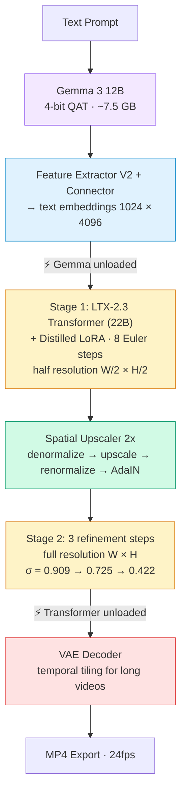
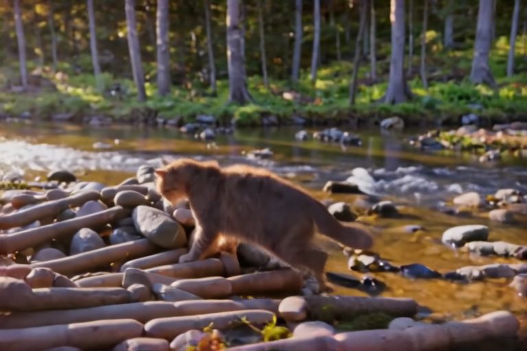
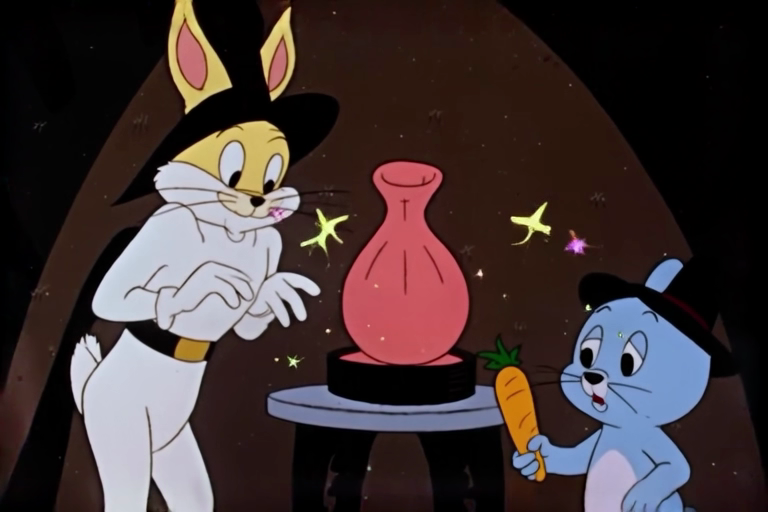

# LTX-Video-Swift-MLX

Swift implementation of [LTX-2](https://github.com/Lightricks/LTX-2) video generation — **LTX-2.3 and LTX-2.5** — optimized for Apple Silicon using [MLX](https://github.com/ml-explore/mlx-swift). Runs entirely on-device.

## Features

| Feature | Status | Notes |
| --- | --- | --- |
| Text-to-Video (two-stage distilled) | **Done** | Matches HuggingFace Space quality |
| Image-to-Video (two-stage distilled) | **Done** | Condition on first frame |
| Video-to-Video (Retake) | **Done** | Full + partial temporal retake |
| Audio generation (I2V + audio) | **Done** | Dual video/audio denoising |
| LoRA inference | **Done** | Fuse any LTX-2.3 compatible LoRA |
| LoRA training (QLoRA) | **Beta** | Fine-tune 22B transformer on Apple Silicon |
| Quantization (qint8/int4) | **Done** | [Benchmarked](docs/benchmarks/) — int4 halves memory |
| LTX-2.5 (text/image-to-video) | **Done** | Gated repo; bundled Gemma 4 encoder, split checkpoint |
| LTX-2.5 auto-duration | **Done** | `--frames auto` predicts the length from the prompt |
| LTX-2.5 diffusion decoder | **Done** (opt-in) | `--diffvae`; element-wise parity with upstream, ~2x the decode cost |
| LTX-2.5 temporal interpolation | **Done** | `interpolate` doubles the frame rate through the temporal upscaler |
| LTX-2.5 generated keyframe slots | **Done** | `--keyframe-slot`; anchors the model generates and later stages reuse |

## Requirements

- macOS 26.3+ (Tahoe)
- Apple Silicon Mac (M1/M2/M3/M4)
- 32 GB+ unified memory recommended
- Xcode 26+
- Xcode Metal Toolchain installed
- Significant free disk space for model weights and caches

> **Disk usage:** the CLI binary itself is relatively small, but the AI model weights are not.  
> LTX-2.3 Distilled reports approximately **46 GB** for the main 22B checkpoint on first use, with additional space required for Gemma/text-encoder weights, caches, temporary files and generated videos. Keep at least **55–70 GB free** for a practical LTX-2.3 setup. LTX-2.5 requires substantially more.

## Quick Start

### Option 1: Download the pre-built CLI

Grab the latest release from the [Releases page](https://github.com/VincentGourbin/ltx-video-swift-mlx/releases).

> [!IMPORTANT]
> The executable **cannot run by itself**. MLX requires its Metal resource bundle:
>
> ```text
> ltx-video
> mlx-swift_Cmlx.bundle/
> └── Contents/
>     └── Resources/
>         └── default.metallib
> ```
>
> If a release archive contains only `ltx-video`, the executable will start but fail when MLX initializes with an error similar to:
>
> ```text
> MLX error: Failed to load the default metallib.
> library not found
> ```
>
> In that case, build from source using the instructions below. Do not use a standalone `ltx-video` binary without the accompanying `mlx-swift_Cmlx.bundle`.

### Option 2: Build from source

Use **`xcodebuild`**, not `swift build`.

MLX requires Metal shaders (`default.metallib`) that are bundled correctly by the Xcode build. A binary produced without its resource bundle will fail at runtime with a `metallib not found` error. See [#3](https://github.com/VincentGourbin/ltx-video-swift-mlx/issues/3).

#### 1. Clone the repository

```bash
git clone https://github.com/VincentGourbin/ltx-video-swift-mlx.git
cd ltx-video-swift-mlx
```

#### 2. Install the Xcode Metal Toolchain

A normal Xcode installation may not include the separate Metal Toolchain component.

Install it before building:

```bash
sudo xcodebuild -downloadComponent MetalToolchain
```

Verify that the Metal compiler is available:

```bash
xcrun metal --version
```

If the Metal Toolchain is missing, the build will fail with:

```text
error: cannot execute tool 'metal' due to missing Metal Toolchain;
use: xcodebuild -downloadComponent MetalToolchain
```

#### 3. Build the release CLI

The project dependencies use both a Swift package build plugin and Swift macros.

When building non-interactively from the command line, Xcode may otherwise stop with errors such as:

```text
Validate plug-in “CudaBuild” in package “mlx-swift”
```

or:

```text
Macro “MLXHuggingFaceMacros” from package “mlx-swift-lm”
must be enabled before it can be used
```

Build with package-plugin and macro validation explicitly skipped:

```bash
xcodebuild \
  -scheme ltx-video \
  -configuration Release \
  -derivedDataPath .xcodebuild \
  -destination 'platform=macOS,arch=arm64' \
  -skipPackagePluginValidation \
  -skipMacroValidation \
  build
```

A successful build ends with:

```text
** BUILD SUCCEEDED **
```

#### 4. Verify the Metal library

Confirm that MLX's `default.metallib` was produced:

```bash
find .xcodebuild/Build/Products/Release \
  -name 'default.metallib' \
  -print
```

Expected output:

```text
.xcodebuild/Build/Products/Release/mlx-swift_Cmlx.bundle/Contents/Resources/default.metallib
```

You can also inspect the bundle directly:

```bash
ls -la \
  .xcodebuild/Build/Products/Release/mlx-swift_Cmlx.bundle/Contents/Resources/
```

#### 5. Run directly from the build output

```bash
.xcodebuild/Build/Products/Release/ltx-video --help
```

Example generation:

```bash
.xcodebuild/Build/Products/Release/ltx-video generate \
  "A cat walking on the beach" \
  -w 768 \
  -h 512 \
  -f 121 \
  -o output.mp4
```

### Portable/local installation

The runtime should keep the executable and the MLX resource bundle together.

Create a clean directory:

```bash
mkdir -p ~/ltx-video
```

Copy the runtime files:

```bash
cp .xcodebuild/Build/Products/Release/ltx-video \
  ~/ltx-video/

cp -R .xcodebuild/Build/Products/Release/mlx-swift_Cmlx.bundle \
  ~/ltx-video/
```

The resulting layout should be:

```text
~/ltx-video/
├── ltx-video
└── mlx-swift_Cmlx.bundle/
    └── Contents/
        ├── Info.plist
        └── Resources/
            └── default.metallib
```

Test it:

```bash
cd ~/ltx-video
./ltx-video --help
```

Then try a small generation before committing to a high-resolution render:

```bash
./ltx-video generate \
  "A small white cloud of smoke drifting slowly against a pure solid black background. Static camera. No text. No other objects." \
  -w 512 \
  -h 512 \
  -f 25 \
  --seed 12345 \
  -o test.mp4
```

### Install globally

If you want `ltx-video` available from your shell PATH, copy **both** the executable and the MLX bundle:

```bash
sudo cp \
  .xcodebuild/Build/Products/Release/ltx-video \
  /usr/local/bin/

sudo cp -R \
  .xcodebuild/Build/Products/Release/mlx-swift_Cmlx.bundle \
  /usr/local/bin/
```

Then:

```bash
ltx-video --help
```

Do not copy only `ltx-video`; the executable requires `mlx-swift_Cmlx.bundle` at runtime.

### First run and model downloads

Models are downloaded automatically when first required.

For example, the default LTX-2.3 distilled text-to-video pipeline may report:

```text
LTX-2.3 Distilled (~46GB) — Video Generation (Two-Stage Distilled)
...
Downloading ltx-2.3-22b-distilled.safetensors...
```

This is expected. The output resolution does **not** determine the checkpoint download size. A `512x512` test render still uses the same underlying 22B model unless a different model/quantization is selected.

Once downloaded, model files are cached and reused by later runs.

Before starting a large download, check available disk space:

```bash
df -h ~
```

### Resolution and frame constraints

Generation currently requires:

- width divisible by **64**
- height divisible by **64**
- frame count of the form **`8n + 1`**

For example, `1920x1080` is **not** valid because `1080` is not divisible by 64.

Use:

```text
1920x1088
```

and crop to 1080p afterwards if required:

```bash
ffmpeg -i input.mp4 \
  -vf "crop=1920:1080:0:4" \
  -c:v libx264 \
  -crf 18 \
  -preset slow \
  output-1080p.mp4
```

For an 8-second clip at 24 fps, use:

```text
193 frames
```

because:

```text
(193 - 1) / 24 = 8 seconds
```

### Generate a Video

```bash
# Standard quality (768x512, 5 seconds)
ltx-video generate "A cat walking on the beach" -w 768 -h 512 -f 121

# High resolution (1024x576, 10 seconds)
ltx-video generate "Ocean waves at sunset" -w 1024 -h 576 -f 241

# With prompt enhancement (recommended)
ltx-video generate "A beaver building a dam" -w 768 -h 512 -f 121 --enhance-prompt

# With quantization (lower memory)
ltx-video generate "A sunset over mountains" -w 768 -h 512 -f 121 --transformer-quant qint8
```

### Image-to-Video

```bash
ltx-video generate "The car drives away into the sunset" \
    --image photo.png -w 768 -h 512 -f 121 --enhance-prompt
```

### Keyframe Interpolation

Pin generation to one or more reference images at chosen pixel positions —
first frame, optional middle frame(s), and/or last frame, in any combination.
`--keyframe PATH:FRAME_IDX` is repeatable; `--image PATH` is shorthand for
`--keyframe PATH:0`.

```bash
# Last-frame anchor: free start, video ends on the reference image
ltx-video generate "A car descends from the sky and lands softly on a road" \
    --keyframe photo.png:120 -w 768 -h 512 -f 121 --audio

# Loop: same image at start and end
ltx-video generate "The car takes off into the sky, then returns to its parking spot" \
    --keyframe photo.png:0 --keyframe photo.png:120 -w 768 -h 512 -f 121

# Mid-anchor: free intro, fixed middle, free outro
ltx-video generate "Descending through clouds, parks here, then takes off again" \
    --keyframe photo.png:120 -w 768 -h 512 -f 241 --audio
```

Latent stride is 8 — two keyframes within the same 8-pixel-frame group
(e.g. pixel 1 and pixel 8) collide on the same latent slot and are rejected.
See [docs/examples/keyframe-interpolation/](docs/examples/keyframe-interpolation/)
for validated end-to-end examples and timings.

### Generative upscaling (LTX-2.5)

The `upscale` command re-renders a finished clip at 2x through the pixel spatial
upscaler IC-LoRA. This is not the latent upscaler `generate` already runs between
its two stages: that one refines inside the diffusion loop, this one takes a
low-resolution clip as a reference and **synthesises** detail that was never in
the source.

```bash
ltx-video upscale "A red vintage car on a gravel driveway, cinematic daylight" \
    --input lowres_384x256.mp4 \
    --width 768 --height 512 --frames 121 \
    --model 2.5-distilled \
    -o upscaled.mp4
```

The scale factor is not an option — it comes from the adapter's
`reference_downscale_factor` metadata, and an output size that does not divide by
it is refused rather than asking the model for a mapping it never learned. The
reference must cover the same shot, duration and framing as the target: this is
not a reframing model.

### Temporal interpolation (LTX-2.5)

The `interpolate` command doubles a clip's frame rate through the temporal
upscaler, then refines the densified latent so the invented frames carry real
motion rather than a blend of their neighbours. Duration is unchanged: 121
frames at 24 fps become 241 at 48.

```bash
ltx-video interpolate "A red vintage 2CV lifting off a gravel driveway" \
    --input clip_121f.mp4 \
    --width 768 --height 512 --frames 121 \
    --model 2.5-distilled \
    -o clip_241f.mp4
```

Long canvases are refined in overlapping tiles, each anchored on the source
frames inside its own window. Renoise level and anchor spacing follow from
whether the canvas tiles at all — a level that is safe in a single window
redraws the subject across a seam, which is
[measured and recorded](docs/knowledge/pitfalls/renoise-level-needs-its-anchor.md).

### Generated keyframe slots (LTX-2.5)

`--keyframe-slot N` asks the model to generate a keyframe at pixel frame `N`
alongside the video — a token it denoises, not a frame it is given. The result
is an anchor produced by the same pass that produced the clip, at full quality:
what a later stage or a later temporal tile conditions on to hold one identity
across a seam.

```bash
ltx-video generate "A red vintage 2CV lifting off a gravel driveway" \
    --model 2.5-distilled -w 768 -h 512 -f 241 \
    --keyframe-slot 96 --keyframe-slot 192 \
    --slots-out anchors.safetensors \
    -o clip.mp4
```

Slots need LTX-2.5's learned keyframe marker; asking for them on an earlier
checkpoint is refused up front. Each costs one latent frame's worth of tokens.

`interpolate --anchors anchors.safetensors` feeds them back in, which is what
they are for: unlike a source frame, a slot has been through no VAE round trip
and no temporal upsample since it was made. Measured on a 121→241 frame clip
with two slots, against the same run without them: worst inter-frame spike
z 5.76 → **2.94**, mean fidelity 23.98 → **24.86 dB**, smoothness unchanged.

### LoRA

```bash
# Apply a LoRA during generation
ltx-video generate "arc shot, camera orbiting the subject, a red car on a road" \
    --image photo.png \
    --lora /path/to/lora.safetensors \
    -w 768 -h 512 -f 121

# Adjust LoRA strength
ltx-video generate "arc shot, camera orbiting the subject" \
    --lora /path/to/lora.safetensors --lora-scale 0.5
```

> **2.3 adapters on a 2.5 checkpoint.** Every module this repo's LoRAs target
> exists in the LTX-2.5 transformer (verified: LipDub 1344 modules, the camera
> LoRAs 384 each, none missing), so they fuse and run — `lipdub --model
> 2.5-distilled` included. The pipeline prints a notice when an adapter declares
> a different generation, because what cannot be checked statically is
> behaviour: 2.5's block FFNs are bias-free where 2.3's were not.

### Retake (Video-to-Video)

Retake regenerates a specific time region of a video from a text prompt while keeping the rest unchanged. It works best on videos **5 seconds or longer** — shorter videos don't give the model enough temporal context to produce visible changes.

**Prompt guidelines** (from our testing, two styles work best):
- **Full scene description**: describe the entire scene including your modification — *"A cute Groot character walking in a city street, a giant fireball with flames flies through the air, 3D Pixar style"*
- **Replacement instruction**: tell the model what to replace — *"Replace the red ball with a fireball with blazing flames and sparks"*

Avoid prompts that only describe the new element without context (e.g., just *"A fireball"*) — the model needs scene context to blend coherently.

```bash
# Full retake: regenerate entire video with new prompt
ltx-video retake "A cat building a dam in a forest stream" \
    --video source.mp4 -w 768 -h 512 -f 121

# Partial retake: regenerate seconds 5-7 of a 10s video
ltx-video retake "Replace the red ball with a fireball with blazing flames and sparks" \
    --video source.mp4 \
    --start-time 5.0 --end-time 7.0 -w 512 -h 512 -f 233

# Retake with LoRA (same flags as generate)
ltx-video retake "A cinematic arc shot around a vintage red car" \
    --video source.mp4 \
    --lora /path/to/lora.safetensors --lora-scale 0.8 \
    -w 768 -h 512 -f 121

# Use distilled mode for faster inference (default: dev model with CFG)
ltx-video retake "The vase explodes into colorful smoke" \
    --video source.mp4 --distilled \
    --start-time 7.0 --end-time 10.0 -w 768 -h 512 -f 241
```

### Audio

```bash
ltx-video generate "A car engine starting" \
    --image car.png --audio -w 768 -h 512 -f 121
```

### LipDub (Reference-Video Lip-Sync)

Lip-sync a reference video to a new prompt using Lightricks' [LipDub IC-LoRA](https://huggingface.co/Lightricks/LTX-2.3-22b-IC-LoRA-LipDub). Both the video reference (frames) and the audio reference (track) condition the generation; the final audio is decoded from the Stage 1 denoised latent (matches Python `lipdub.py`).

The LipDub LoRA is gated on HF — accept the license and run `huggingface-cli login` once (or pass `--hf-token`).

```bash
ltx-video lipdub "a person speaking the dialogue" \
    --reference-video source.mp4 \
    -w 768 -h 512 -f 121 --seed 42

# Dubbing: supply a separate target audio (e.g. TTS in a new language).
# Framework auto-detects speech windows and time-stretches the target (pitch
# preserved) so its speech aligns with the source video's mouth movements.
ltx-video lipdub "A person speaking in English saying: \"Hello everyone...\"" \
    --reference-video source.mp4 \
    --target-audio english_tts.wav \
    -w 768 -h 512 -f 121

# Animate a still photo: use --reference-image (single I2V keyframe) +
# --target-audio. Add --enhance-prompt to let the multimodal Gemma VLM
# describe the scene from the image.
ltx-video lipdub 'Speaking in Spanish saying: "Hola a todos..."' \
    --reference-image portrait.jpg \
    --target-audio spanish_tts.wav \
    --enhance-prompt \
    -w 768 -h 512 -f 121
```

See [docs/examples/lipdub/README.md](docs/examples/lipdub/README.md) for pipeline details and constraints.

**Segment chaining (image mode)**: long dialogues are generated as chained segments. Pass the **previous segment's video** to `--continuation-tail` — the framework reads its last 9 frames itself (natively, via AVFoundation; no clip preparation, no external tool) and anchors the new segment on them instead of re-starting from the still image, preserving position and motion across the cut (measured seam PSNR: 17.4 dB photo re-anchor → 24.6 dB with continuation). The first output frame duplicates the anchor: drop one frame when concatenating. Cut segments inside speech pauses: both sides of the seam then have a closed mouth, which hides any residual discontinuity.

```bash
# segment 2 continues segment 1 — no intermediate clip
ltx-video lipdub 'Speaking in French saying: "…suite du dialogue."' \
    --continuation-tail segment1.mp4 \
    --target-audio segment2_tts.wav \
    -w 704 -h 1024 -f 233
```

**Consecutive runs (Swift package):** the IC-LoRA is fused destructively into the 22B transformer. Consecutive `generateLipDub` calls with the same LoRA **and the same scale** reuse the fused transformer without re-fusing — no model reload per segment — provided the transformer survives between runs (`MemoryOptimizationConfig.disabled`, i.e. `unloadAfterUse: false`). Switching LoRA or scale, or running `generateVideo`/`generateRetake` while fused, throws until `loadModels()` + `loadAudioModels()` restore pristine weights. Check `pipeline.fusedLipDubLoRAPath` / `fusedLipDubLoRAScale` for the current state.

**LoRA scale (`--lora-scale`, `lipdubLoRAScale:`, default 1.0)** — experimental. The delta is applied as `W' = W + scale · B·A`; the shipped IC-LoRA carries no `alpha` keys, so the value you pass is the whole multiplier. **Leave it at 1.0 unless you are experimenting**: this is an *in-context* LoRA, not a style LoRA — it teaches the transformer how to read the appended reference tokens (audio at negative positions, video reference), so scaling it down weakens the conditioning mechanism itself rather than softening an effect. Lightricks publishes it for use at 1.0. Values outside `0.5...1.5` log a warning; `<= 0` throws.

### LoRA Training (Beta)

> **Status**: Validated end-to-end (July 2026) on [Wild-Heart/Disney-VideoGeneration-Dataset](https://huggingface.co/datasets/Wild-Heart/Disney-VideoGeneration-Dataset): overfit + QLoRA parity runs, then a full 69-clip style LoRA (1500 steps, 4h45, 61 GB peak on M3 Max 96 GB), fused and used for generation. Measured baselines and the memory-sizing rule live in [docs/knowledge](docs/knowledge/benchmarks/lora-training-baselines-m3max.md).
>
> **Memory**: training defaults to a **qint8-quantized frozen base (QLoRA)** — bf16 training peaks at 84+ GB and swaps on 96 GB machines ([why](docs/knowledge/decisions/qlora-training-default.md)). Works on both `dev` (recommended for quality) and `distilled` bases.

Train a LoRA on the dev model using QLoRA (quantized base weights) to fit on Apple Silicon:

```bash
# Prepare dataset: directory of video.mp4 + video.txt pairs
# Each .txt file contains a caption for the corresponding video

# Train with trigger word (e.g., Cakeify style)
ltx-video train dataset/ -o /tmp/my-lora \
    --model dev --rank 16 --steps 2000 --save-every 250 \
    -w 512 -h 512 -f 121 --transformer-quant qint8 \
    --lora-blocks 16 --trigger-word "MYSTYLE"

# Use the trained LoRA for generation
ltx-video generate "MYSTYLE a red car on a road" \
    --lora /tmp/my-lora/lora-final.safetensors \
    -w 768 -h 512 -f 121
```

A `learning_curve.svg` is generated live in the output directory for monitoring.

**Selective LoRA blocks**: `--lora-blocks 16` trains only the last 16 of 48 transformer blocks, cutting backward graph memory via `stopGradient()`. This enables training at higher resolutions and frame counts (e.g. 512×512×121f on 96GB). The last blocks control style and texture — sufficient for most style-transfer LoRAs.

**Aspect ratio**: training videos are automatically resized to fit within the `--width`/`--height` budget while preserving their native aspect ratio (dimensions rounded to 32). No stretching or distortion.

**Memory presets** (all use int4 quantization for the 22B model):

| Preset | RAM | Rank | Resolution | Frames |
| --- | --- | --- | --- | --- |
| `compact` | 32GB | 16 | 256x256 | 9 |
| `balanced` | 64GB | 32 | 384x384 | 9 |
| `quality` | 96GB | 64 | 512x512 | 9 |
| `max` | 192GB+ | 128 | 512x512 (bf16) | 9 |

Models are downloaded automatically on first run.

**LTX-2.3** (~30 GB, open repos): [Lightricks/LTX-2.3](https://huggingface.co/Lightricks/LTX-2.3) plus [mlx-community/gemma-3-12b-it-qat-4bit](https://huggingface.co/mlx-community/gemma-3-12b-it-qat-4bit) for the text encoder.

**LTX-2.5** (~70 GB, **gated**): [Lightricks/LTX-2.5](https://huggingface.co/Lightricks/LTX-2.5) ships one file per component and bundles its own Gemma 4 text encoder — there is no community quantization of that derivative, so `--transformer-quant` drives the encoder too. Accept the licence on the model page, then provide a token via `--hf-token`, `$HF_TOKEN`, or `huggingface-cli login`.

```bash
ltx-video models          # variants, licences, gating and what actually runs today
ltx-video generate --model 2.5-distilled --frames auto \
    --image first-frame.png "your prompt"
```

## Troubleshooting

### `Failed to load the default metallib`

Example:

```text
MLX error: Failed to load the default metallib.
library not found
```

Cause: `mlx-swift_Cmlx.bundle` or its `default.metallib` resource is missing from the runtime directory.

Verify:

```bash
find . -name 'default.metallib' -print
```

A valid local runtime should contain:

```text
./mlx-swift_Cmlx.bundle/Contents/Resources/default.metallib
```

If it does not, rebuild with `xcodebuild` as described above.

### `Validate plug-in "CudaBuild" in package "mlx-swift"`

Use:

```text
-skipPackagePluginValidation
```

in the `xcodebuild` command.

The plugin may still run during an Apple Silicon build and report:

```text
CUDA Build Plugin
CUDA is disabled
```

That message is normal on macOS/Apple Silicon.

### `MLXHuggingFaceMacros ... must be enabled`

Use:

```text
-skipMacroValidation
```

in the `xcodebuild` command.

### `cannot execute tool 'metal' due to missing Metal Toolchain`

Install the Metal Toolchain:

```bash
sudo xcodebuild -downloadComponent MetalToolchain
```

Then verify:

```bash
xcrun metal --version
```

and rebuild.

### Width and height must be divisible by 64

For example:

```text
1920x1080
```

fails because `1080` is not divisible by 64.

Use a compatible canvas such as:

```text
1920x1088
```

and crop after generation if a strict delivery resolution is required.

## Swift Package Integration

Add to your `Package.swift`:

```swift
dependencies: [
    .package(url: "https://github.com/VincentGourbin/ltx-video-swift-mlx.git", branch: "main")
]
```

### Inference

```swift
import LTXVideo

let pipeline = LTXPipeline(model: .distilled)
try await pipeline.loadModels()
let upscalerPath = try await pipeline.downloadUpscalerWeights()

let config = LTXVideoGenerationConfig(width: 768, height: 512, numFrames: 121)
let result = try await pipeline.generateVideo(
    prompt: "A cat walking in a garden",
    config: config,
    upscalerWeightsPath: upscalerPath
)

try await VideoExporter.exportVideo(
    frames: result.frames, width: 768, height: 512,
    to: URL(fileURLWithPath: "output.mp4")
)
```

#### Keyframe Interpolation

Constrain generation to pass through one or more reference images at chosen
pixel positions. The legacy `imagePath` field is preserved as a single keyframe
at pixel 0 (mathematically equivalent to before for the default
`imageCondNoiseScale = 0`).

```swift
import LTXVideo

let config = LTXVideoGenerationConfig(
    width: 768, height: 512, numFrames: 241,
    seed: 42,
    keyframes: [
        KeyframeInput(path: "/abs/path/start.png", pixelFrameIndex: 0),
        KeyframeInput(path: "/abs/path/end.png",   pixelFrameIndex: 240)
    ]
)
try config.validate()  // throws on missing file, range, slot collision, strength != 1.0

let result = try await pipeline.generateVideo(
    prompt: "Smooth transition between two scenes",
    config: config,
    upscalerWeightsPath: upscalerPath
)
```

`KeyframeInput` fields:
- `path: String` — image file path (any format `loadImage` accepts).
- `pixelFrameIndex: Int` — target pixel position, in `[0, numFrames - 1]`.
- `strength: Float` — must be `1.0` (hard injection); soft conditioning not yet wired.

Helpers exposed for advanced use:
- `pixelFrameToLatentFrame(_:)` — maps pixel index to latent slot (stride 8).
- `validateKeyframes(_:numFrames:)` — same checks as `LTXVideoGenerationConfig.validate()` runs.

### LoRA Training (Beta)

```swift
import LTXVideo

let config = LoRATrainingConfig(
    rank: 64,
    learningRate: 2e-4,
    maxSteps: 2000,
    saveEvery: 500,
    width: 384,
    height: 384,
    numFrames: 9,
    transformerQuant: "int4",
    triggerWord: "MYSTYLE",
    ltxWeightsPath: "/path/to/ltx-2.3-22b-dev.safetensors"
)

let trainer = LoRATrainer(
    config: config,
    datasetPath: "/path/to/dataset",  // mp4 + txt pairs
    outputDir: "/tmp/my-lora"
)

try await trainer.train { progress in
    print(progress.status)  // "Step 42/2000 [2%] loss=0.523 lr=2.00e-04"
}
// Outputs: lora-final.safetensors, checkpoint-stepN.safetensors, learning_curve.svg
```

### Model Registry

```swift
import LTXVideo

// List available models with their licensing and gating
for model in LTXModel.allCases {
    print("\(model.rawValue): inference=\(model.isForInference), training=\(model.isForTraining)")
    print("  \(model.variantDescription)")
    print("  Size: \(model.estimatedSizeGB)GB, licence: \(model.licenseName)")
    print("  Gated: \(model.isGated) — \(model.huggingFaceURL)")
    print("  Text encoder: \(model.textEncoder.displayName)")
}

// Upscalers, distilled LoRAs and IC-LoRAs carry the same metadata
for aux in LTXAuxiliaryModel.allCases where aux.gating.requiresToken {
    print("\(aux.displayName) needs a licence accepted at \(aux.huggingFaceURL)")
}

// Print formatted table
LTXModel.printModelList()

// Check system compatibility
let ram = LTXModelRegistry.systemRAMGB
print("System RAM: \(ram) GB")
```

## Activity Beacon (Opt-in)

Heavy operations (generation, model loading, LoRA training) can advertise themselves to external activity monitors such as [SiliconScope](https://github.com/kennss/SiliconScope). While the operation runs, a small JSON manifest lives at `~/Library/Application Support/ai-runtime-beacons/<pid>-<id>.json` and is deleted the moment it ends — errors included. Nothing is ever written unless you opt in:

```swift
// Swift package
RuntimeBeacon.isEnabled = true
```

```bash
# CLI: --beacon flag (generate / retake / lipdub / train / profile),
# or the environment variable
LTX_RUNTIME_BEACON=1 ltx-video generate "..."
```

The manifest schema is deliberately runtime-agnostic (`version`, `pid`, `runtime`, `displayName`, `task`, `model`, `phase`, `step`, `totalSteps`, timestamps) so any local-AI framework can adopt the same convention and monitors only need one reader. Manifests left behind by a force-killed process are garbage-collected on the next beacon start via a pid liveness check.

> **Note:** sandboxed apps write inside their container, invisible to external monitors — the beacon targets CLI tools and non-sandboxed apps.

## Pipeline Architecture

The `generate` command runs a **two-stage distilled pipeline** matching the [LTX-2 HuggingFace Space](https://huggingface.co/spaces/Lightricks/LTX-2):



## CLI Reference

### `ltx-video generate`

| Flag | Default | Description |
| --- | --- | --- |
| `<prompt>` | required | Text prompt |
| `-o, --output` | `output.mp4` | Output file path |
| `-w, --width` | `768` | Video width (divisible by 64) |
| `-h, --height` | `512` | Video height (divisible by 64) |
| `-f, --frames` | `121` | Frame count (must be 8n+1) |
| `--seed` | random | Random seed |
| `--image` | none | Input image for I2V (shorthand for `--keyframe PATH:0`) |
| `--keyframe` | none | Repeatable keyframe spec `PATH:FRAME_IDX[:STRENGTH]` (mutually exclusive with `--image`) |
| `--lora` | none | Path to LoRA .safetensors file |
| `--lora-scale` | `1.0` | LoRA strength (0.0–1.0) |
| `--audio` | off | Enable audio generation |
| `--audio-gain` | `1.0` | Audio gain (linear) |
| `--enhance-prompt` | off | Enhance prompt with Gemma VLM |
| `--diffvae` | off | Decode with LTX-2.5's diffusion VAE (finer detail, ~2x the decode cost) |
| `--keyframe-slot` | none | Repeatable pixel-frame index for a generated keyframe slot (LTX-2.5) |
| `--slots-out` | none | Write the generated keyframes (latents) to this path |
| `--transformer-quant` | `bf16` | Quantization: `bf16`, `qint8`, `int4`, `nvfp4`, `mxfp8` |
| `--mixed-precision` | off | Per-block quantization: first/last 6 blocks qint8, middle int4 |
| `--bitrate` | auto | Video bitrate in kbps |
| `--debug` | off | Debug output |
| `--beacon` | off | Advertise activity to external monitors (see [Activity Beacon](#activity-beacon-opt-in)) |
| `--profile` | off | GPU/CPU profiling report + Chrome Trace export |

### `ltx-video export-quantized`

Export a quantized transformer to safetensors for reuse (skip on-the-fly quantization).

```bash
ltx-video export-quantized \
    --input /path/to/ltx-2.3-22b-distilled.safetensors \
    --output /path/to/ltx-2.3-22b-distilled-nvfp4.safetensors \
    --mode nvfp4
```

| Flag | Default | Description |
| --- | --- | --- |
| `--input` | required | Path to bf16 unified weights |
| `-o, --output` | required | Output safetensors path |
| `--mode` | `nvfp4` | Quantization mode: `nvfp4`, `mxfp8`, `qint8`, `int4` |

### `ltx-video retake`

| Flag | Default | Description |
| --- | --- | --- |
| `<prompt>` | required | New text prompt (describe full scene or replacement instruction) |
| `--video` | required | Source video path |
| `--start-time` | none | Start of region to regenerate (seconds) |
| `--end-time` | none | End of region to regenerate (seconds) |
| `-o, --output` | `retake.mp4` | Output file path |
| `-w, --width` | `768` | Video width (divisible by 32) |
| `-h, --height` | `512` | Video height (divisible by 32) |
| `-f, --frames` | `121` | Frame count (must be 8n+1) |
| `--seed` | random | Random seed |
| `--distilled` | off | Use distilled model (8 steps, fast). Default: dev (30 steps + CFG) |
| `--steps` | `30` | Inference steps — dev model only (the distilled model runs a fixed trained 8-step schedule; custom counts there produce artifacts) |
| `--enhance-prompt` | off | Enhance prompt with Gemma VLM |
| `--transformer-quant` | `bf16` | Quantization: `bf16`, `qint8`, `int4`, `nvfp4`, `mxfp8` |
| `--mixed-precision` | off | Per-block quantization: first/last 6 blocks qint8, middle int4 |
| `--regenerate-audio` | off | Regenerate audio via dual denoising (default: preserve source audio) |
| `--beacon` | off | Advertise activity to external monitors (see [Activity Beacon](#activity-beacon-opt-in)) |
| `--profile` | off | GPU/CPU profiling report + Chrome Trace export |

### `ltx-video interpolate`

Doubles the frame rate through the temporal upscaler. Duration is unchanged.

| Flag | Default | Description |
| --- | --- | --- |
| `<prompt>` | required | Describes the clip — the refinement still conditions on text |
| `-i, --input` | required | Source video |
| `-o, --output` | `interpolated.mp4` | Output file path |
| `-w, --width` / `-h, --height` | `768` / `512` | Source geometry (must match the clip) |
| `-f, --frames` | `121` | Source frame count (8n+1) |
| `--fps` | `48` | Output frame rate; twice the source's 24 |
| `--eta` | `0.5` | How ancestral the refinement is: 0 interpolates, 1 invents most |
| `--renoise-from` | auto | Level the refinement starts from — `0.975` single-window, `0.725` tiled |
| `--anchor-every` | auto | Anchor every Nth source frame (0 disables) — `4` single-window, `1` tiled |
| `--tile-frames` | `32` | Max latent frames denoised at once; lower trades speed for memory |
| `--source-fps` | `24` | Source frame rate; the refined clip is positioned at twice it, capped at 60 |
| `--anchors` | none | Generated keyframes from `generate --slots-out`, reused as anchors |
| `--carry-forward` | off | Also anchor each tile on the previous tile's output — measured slightly worse than the tiled defaults for twice the time, kept for experimentation |
| `--seed` | random | Random seed |
| `--model` | `2.5-distilled` | Temporal upsampling ships with LTX-2.5 |

The two `auto` defaults are measured, not guessed: an independent tile started
at 0.975 stops agreeing with its neighbour at the seam, and the anchors are what
make the high level viable in a single window.

### `ltx-video train`

| Flag | Default | Description |
| --- | --- | --- |
| `<dataset>` | required | Path to dataset directory (mp4 + txt pairs) |
| `-o, --output` | required | Output directory for checkpoints and LoRA |
| `--model` | `dev` | Base model: `dev` (recommended for quality) or `distilled` (validated too) |
| `--rank` | `16` | LoRA rank |
| `--alpha` | same as rank | LoRA alpha |
| `--lr` | `2e-4` | Learning rate |
| `--steps` | `2000` | Max training steps |
| `--save-every` | `250` | Checkpoint interval |
| `-w, --width` | `256` | Training video width (divisible by 32) |
| `-h, --height` | `256` | Training video height (divisible by 32) |
| `-f, --frames` | `9` | Frame count (must be 8n+1) |
| `--transformer-quant` | `qint8` | Base quantization: `qint8` (default), `int4`, `bf16` (swaps on ≤96 GB — see [QLoRA decision](docs/knowledge/decisions/qlora-training-default.md)); `nvfp4`/`mxfp8` rejected (no on-the-fly support) |
| `--lora-blocks` | `0` | Train only last N blocks (0 = all). Reduces memory for long videos |
| `--trigger-word` | none | Trigger word to prepend to captions |
| `--grad-accum` | `1` | Gradient accumulation steps |
| `--max-grad-norm` | `1.0` | Gradient clipping norm |
| `--warmup-steps` | `100` | LR warmup steps |
| `--lr-schedule` | `cosine` | LR schedule after warmup: `cosine` (decay to 10% of peak) or `constant`. **Default changed July 2026** (was constant); resume of older checkpoints requires `constant` |
| `--preset` | none | Memory preset: `compact`, `balanced`, `quality`, `max` |
| `--beacon` | off | Advertise activity to external monitors (see [Activity Beacon](#activity-beacon-opt-in)) |

### `ltx-video models`

List available models with capabilities (inference, training, license).

### `ltx-video download`

Pre-download model weights.

### `ltx-video info`

Show version and pipeline information.

## Examples

See [docs/examples/](docs/examples/) for generation examples with parameters and videos.

### Text-to-Video (10 seconds, 1024x576)

[](https://github.com/VincentGourbin/ltx-video-swift-mlx/raw/main/docs/examples/text-to-video/t2v-1024x576-10s.mp4)

*"A beaver building a dam in a peaceful forest stream, golden hour lighting" — 241 frames, two-stage distilled, prompt enhanced. [Full details →](docs/examples/text-to-video/)*

### Image-to-Video (10 seconds, 1024x576)

[](https://github.com/VincentGourbin/ltx-video-swift-mlx/raw/main/docs/examples/image-to-video/i2v-1024x576-10s.mp4)

*Red 2CV taking off Back to the Future style — from input image, 241 frames, prompt enhanced. [Full details →](docs/examples/image-to-video/)*

### LoRA — Camera Arcshot (5 seconds, 768x512)

| With arcshot LoRA | Without LoRA |
|---|---|
| [](https://github.com/VincentGourbin/ltx-video-swift-mlx/raw/main/docs/examples/lora/i2v-arcshot-v2-lora.mp4) | [](https://github.com/VincentGourbin/ltx-video-swift-mlx/raw/main/docs/examples/lora/i2v-arcshot-v2-nolora.mp4) |

*Same prompt and seed — the LoRA adds arc shot camera movement. [Full details →](docs/examples/lora/)*

### Image-to-Video + Audio (10 seconds, 1024x576)

[](https://github.com/VincentGourbin/ltx-video-swift-mlx/raw/main/docs/examples/audio/i2v-audio-1024x576-10s.mp4)

*Red 2CV engine start with synchronized audio — dual video/audio denoising, 241 frames. [Full details →](docs/examples/audio/)*

### Full Retake — Beaver to Cat (5 seconds, 768x512)

[](https://github.com/VincentGourbin/ltx-video-swift-mlx/raw/main/docs/examples/retake/retake-full-768x512-5s.mp4)

*Source beaver video regenerated as a cat — strength 0.8, prompt enhanced, 121 frames. [Full details →](docs/examples/retake/)*

### Partial Retake — Vase Explodes (10 seconds, 768x512)

[](https://github.com/VincentGourbin/ltx-video-swift-mlx/raw/main/docs/examples/retake/retake-partial-768x512-10s.mp4)

*Last 3 seconds regenerated with exploding vase — first 7s preserved from source, 241 frames. [Full details →](docs/examples/retake/)*

## Performance

Benchmarked on Apple Silicon **M3 Max 96GB**, macOS 26.3 (Tahoe).

### I2V + Audio — 1024x576, 241 frames (10s)

| Quantization | Generation Time | Peak GPU | Mean GPU (denoise) | Audio Quality |
|---|---|---|---|---|
| **bf16** (default) | 1145s | 54.8 GB | 49.7 GB | -11.7 dBFS peak |
| **qint8** | 1458s | 44.6 GB | 32.7 GB | -12.2 dBFS peak |
| **int4** | 1294s | 38.4 GB | 23.7 GB | -11.9 dBFS peak |

- **bf16** is fastest when the model fits in memory (96GB+)
- **int4** halves denoising memory (24 GB vs 50 GB) — enables 32-64 GB machines
- Audio quality is preserved across all quantization levels

See [docs/benchmarks/](docs/benchmarks/) for full benchmark details and methodology.

## Constraints

- **Frame count**: Must be `8n + 1` (9, 17, 25, 33, 41, 49, 57, 65, 73, 81, 89, 97, 105, 113, 121, ...), up to 481 (= 20 s at 24 fps — the model's RoPE positional range; typical training clips are shorter, so expect some quality softening on very long videos)
- **LipDub segments**: capped at **233 frames** (~9.7 s), not 481 — the audio reference sits at negative RoPE positions, so the audio stream spans twice the segment duration against the same 20 s window. Beyond that the lips lag by a constant offset (measured ~0.75 s at 377 frames). Split longer dialogue and chain with `--continuation-tail`; `generateLipDub` warns when the span overruns.
- **Resolution**: Width and height divisible by 64
- **Recommended**: 768x512, 1024x576, 832x480

## Credits

- [LTX-2](https://github.com/Lightricks/LTX-2) by Lightricks
- [MLX](https://github.com/ml-explore/mlx-swift) by Apple
- [Gemma 3](https://ai.google.dev/gemma) by Google

## License

MIT License. See [LICENSE](LICENSE).
