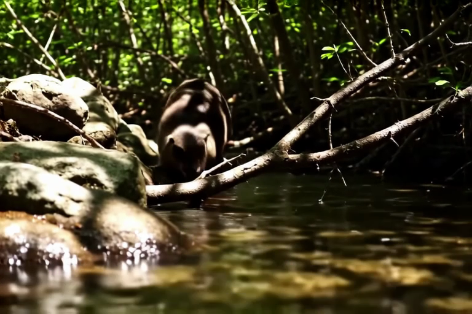
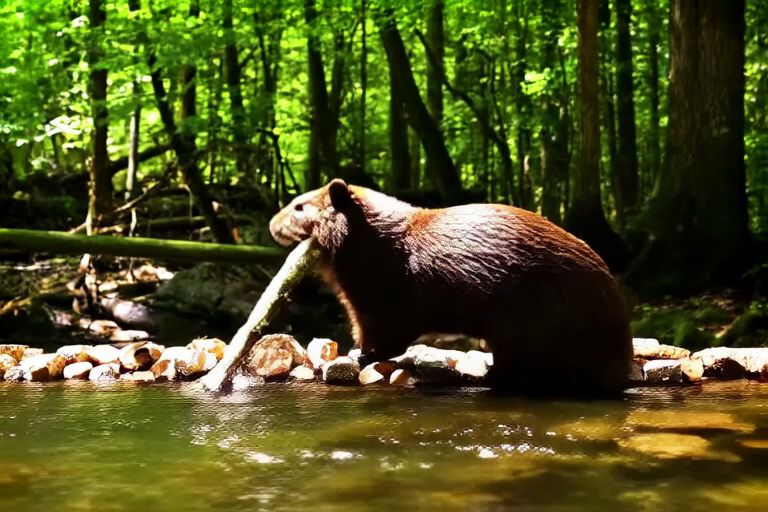
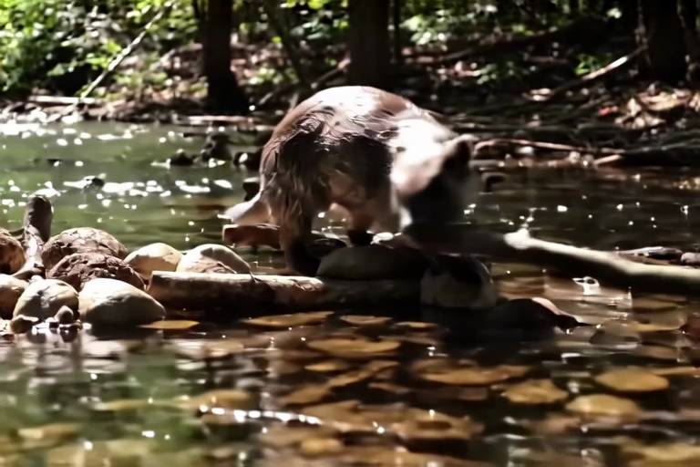
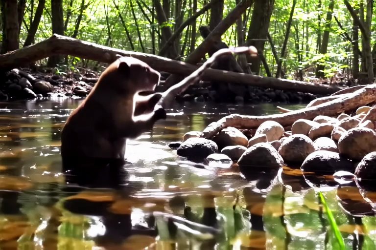
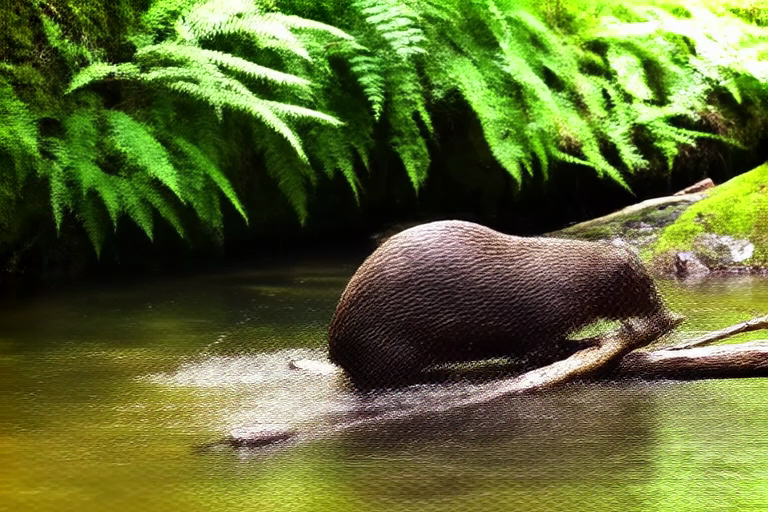
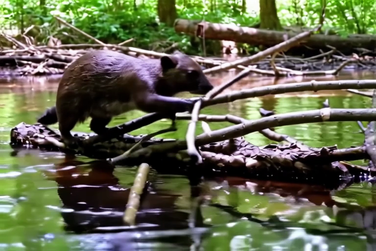

# Beaver Dam — 6 Configuration Comparison

**Prompt**: *"A beaver building a dam in a forest stream, detailed fur, water splashing, natural lighting"*

All videos generated with: `--enhance-prompt --seed 42 --profile --debug -w 768 -h 512 -f 25`

## Performance Summary

| # | Configuration | Model | Steps | CFG | Resolution | Time | Peak RAM | Mean RAM |
|---|---------------|-------|-------|-----|------------|------|----------|----------|
| 1 | Distilled | distilled | 8 | 1.0 | 768x512 | 113s | 52 GB | 27 GB |
| 2 | Dev | dev | 40 | 4.0 | 768x512 | 799s | 55 GB | 27 GB |
| 3 | Dev + LoRA | dev + distilled LoRA | 8 | 1.0 | 768x512 | 102s | 52 GB | 27 GB |
| 4 | Distilled + Upscaler | distilled | 8+3 | 1.0 | 384x256 -> 768x512 | 81s | 52 GB | 27 GB |
| 5 | Dev + Upscaler | dev | 40+3 | 4.0 | 384x256 -> 768x512 | 281s | 55 GB | 27 GB |
| 6 | Dev + LoRA + Upscaler | dev + distilled LoRA | 8+3 | 1.0 | 384x256 -> 768x512 | 78s | 52 GB | 27 GB |

*Hardware: Apple Silicon M3 Max 96GB. Peak RAM includes model loading phase.*

## Visual Comparison (Frame 12)

| Distilled | Dev | Dev + LoRA |
|-----------|-----|------------|
|  |  |  |

| Distilled + Upscaler | Dev + Upscaler | Dev + LoRA + Upscaler |
|----------------------|----------------|------------------------|
|  |  |  |

---

## Detailed Results

### 1. Distilled

8 steps, no CFG. Fastest single-stage option.

```bash
ltx-video generate "A beaver building a dam in a forest stream, detailed fur, water splashing, natural lighting" \
    -m distilled --enhance-prompt --seed 42 --profile --debug \
    -w 768 -h 512 -f 25 -o docs/examples/beaver-dam/distilled.mp4
```

**Video**: [distilled.mp4](distilled.mp4)

<details>
<summary>Profiling output</summary>

```
Denoising (8 steps):                 80.0s
  Step 0: 8.3s
  Step 1: 8.4s
  Step 2: 8.7s
  Step 3: 8.9s
  Step 4: 11.6s
  Step 5: 12.5s
  Step 6: 11.5s
  Step 7: 10.2s
  Average per step:                      10.0s
VAE Decoding:                            4.3s
Pipeline total (excl. loading/export):   84.3s

Peak GPU memory:                         52943 MB
Mean GPU memory (denoising):              26962 MB
```
</details>

---

### 2. Dev

40 steps with CFG 4.0. Best single-stage quality.

```bash
ltx-video generate "A beaver building a dam in a forest stream, detailed fur, water splashing, natural lighting" \
    -m dev --enhance-prompt --seed 42 --profile --debug \
    -w 768 -h 512 -f 25 -o docs/examples/beaver-dam/dev.mp4
```

**Video**: [dev.mp4](dev.mp4)

<details>
<summary>Profiling output</summary>

```
Text Encoding (Gemma + FE + Connector): 49.1s
Denoising (40 steps):                 745.5s
  Step 0: 25.3s   Step 10: 16.7s   Step 20: 19.5s   Step 30: 18.2s
  Step 1: 22.5s   Step 11: 16.8s   Step 21: 20.2s   Step 31: 18.2s
  Step 2: 21.3s   Step 12: 16.9s   Step 22: 20.6s   Step 32: 17.7s
  Step 3: 20.5s   Step 13: 16.9s   Step 23: 20.8s   Step 33: 17.6s
  Step 4: 19.1s   Step 14: 17.3s   Step 24: 20.4s   Step 34: 17.6s
  Step 5: 18.4s   Step 15: 17.3s   Step 25: 20.1s   Step 35: 17.6s
  Step 6: 17.6s   Step 16: 17.6s   Step 26: 19.3s   Step 36: 17.4s
  Step 7: 17.7s   Step 17: 18.0s   Step 27: 19.1s   Step 37: 17.3s
  Step 8: 17.4s   Step 18: 18.6s   Step 28: 19.0s   Step 38: 17.5s
  Step 9: 16.8s   Step 19: 18.9s   Step 29: 18.3s   Step 39: 17.4s
  Average per step:                      18.6s
VAE Decoding:                            4.2s
Pipeline total (excl. loading/export):   798.8s

Peak GPU memory:                         54523 MB
Mean GPU memory (denoising):              26969 MB
```
</details>

---

### 3. Dev + Distilled LoRA

Dev model weights with distilled LoRA fused in. 8 steps, no CFG — dev quality at distilled speed.

```bash
ltx-video generate "A beaver building a dam in a forest stream, detailed fur, water splashing, natural lighting" \
    --distilled-lora --enhance-prompt --seed 42 --profile --debug \
    -w 768 -h 512 -f 25 -o docs/examples/beaver-dam/dev-lora.mp4
```

**Video**: [dev-lora.mp4](dev-lora.mp4)

<details>
<summary>Profiling output</summary>

```
Text Encoding (Gemma + FE + Connector): 30.2s
Denoising (8 steps):                 67.5s
  Step 0: 9.7s
  Step 1: 8.4s
  Step 2: 8.4s
  Step 3: 8.3s
  Step 4: 8.4s
  Step 5: 8.2s
  Step 6: 8.1s
  Step 7: 8.1s
  Average per step:                      8.4s
VAE Decoding:                            4.1s
Pipeline total (excl. loading/export):   101.9s

Peak GPU memory:                         52943 MB
Mean GPU memory (denoising):              26962 MB
```
</details>

---

### 4. Distilled + Upscaler

Two-stage: distilled at 384x256, then upscale 2x and refine at 768x512.

```bash
ltx-video generate "A beaver building a dam in a forest stream, detailed fur, water splashing, natural lighting" \
    -m distilled --two-stage --enhance-prompt --seed 42 --profile --debug \
    -w 768 -h 512 -f 25 -o docs/examples/beaver-dam/distilled-upscaler.mp4
```

**Video**: [distilled-upscaler.mp4](distilled-upscaler.mp4)

<details>
<summary>Profiling output</summary>

```
Text Encoding (Gemma + FE + Connector): 5.2s
Denoising (11 steps):                 44.4s
  Stage 1 (384x256, 8 steps):
    Step 0: 3.6s
    Step 1: 2.5s
    Step 2-7: ~2.4s each
  Stage 2 (768x512, 3 steps):
    Step 8: 8.4s
    Step 9: 7.7s
    Step 10: 7.7s
  Average per step:                      4.0s
VAE Decoding:                            4.1s
Pipeline total (excl. loading/export):   53.6s

Peak GPU memory:                         52943 MB
Mean GPU memory (denoising):              27467 MB
```
</details>

---

### 5. Dev + Upscaler

Two-stage: dev model (40 steps, CFG 4.0) at 384x256, then upscale 2x and refine at 768x512.

```bash
ltx-video generate "A beaver building a dam in a forest stream, detailed fur, water splashing, natural lighting" \
    -m dev --two-stage --steps 40 --guidance 4.0 --enhance-prompt --seed 42 --profile --debug \
    -w 768 -h 512 -f 25 -o docs/examples/beaver-dam/dev-upscaler.mp4
```

**Video**: [dev-upscaler.mp4](dev-upscaler.mp4)

<details>
<summary>Profiling output</summary>

```
Text Encoding (Gemma + FE + Connector): 9.1s
Denoising (43 steps):                 242.9s
  Stage 1 (384x256, 40 steps with CFG):
    Step 0: 4.3s  ... Step 39: 5.4s
    Average: ~4.8s/step
  Stage 2 (768x512, 3 steps):
    Step 40: 19.6s
    Step 41: 16.4s
    Step 42: 15.4s
  Average per step (all):                5.6s
VAE Decoding:                            4.1s
Pipeline total (excl. loading/export):   256.1s

Peak GPU memory:                         54523 MB
Mean GPU memory (denoising):              27100 MB
```
</details>

---

### 6. Dev + LoRA + Upscaler (Two-Stage)

The standard HuggingFace Space pipeline: dev model with distilled LoRA, 8 steps at 384x256, then upscale 2x and refine with 3 steps at 768x512.

```bash
ltx-video generate "A beaver building a dam in a forest stream, detailed fur, water splashing, natural lighting" \
    --distilled-lora --two-stage --enhance-prompt --seed 42 --profile --debug \
    -w 768 -h 512 -f 25 -o docs/examples/beaver-dam/two-stage.mp4
```

**Video**: [two-stage.mp4](two-stage.mp4)

<details>
<summary>Profiling output</summary>

```
Text Encoding (Gemma + FE + Connector): 4.6s
Denoising (11 steps):                 41.9s
  Stage 1 (384x256, 8 steps):
    Step 0: 2.9s
    Step 1-7: ~2.2s each
  Stage 2 (768x512, 3 steps):
    Step 8: 8.3s
    Step 9: 7.4s
    Step 10: 7.7s
  Average per step:                      3.8s
VAE Decoding:                            4.0s
Pipeline total (excl. loading/export):   50.5s

Peak GPU memory:                         52943 MB
Mean GPU memory (denoising):              27467 MB
```
</details>

---

## Reproduction

All commands can be run sequentially. Models are auto-downloaded on first run (~20-25 GB depending on variant).

To extract comparison frames:
```bash
for f in distilled dev dev-lora distilled-upscaler dev-upscaler two-stage; do
    ffmpeg -i docs/examples/beaver-dam/$f.mp4 \
        -vf "select=eq(n\,12)" -vframes 1 \
        docs/examples/beaver-dam/frames/${f}_frame_12.png
done
```
