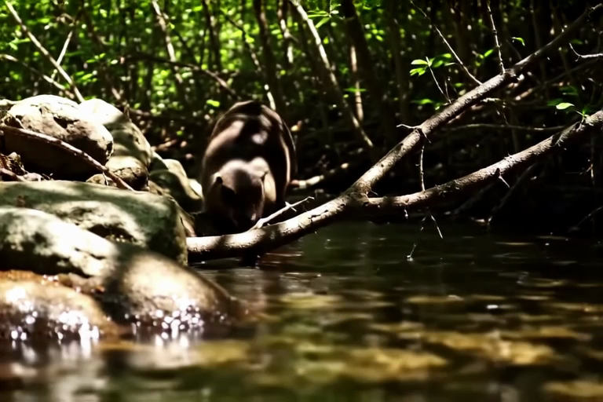
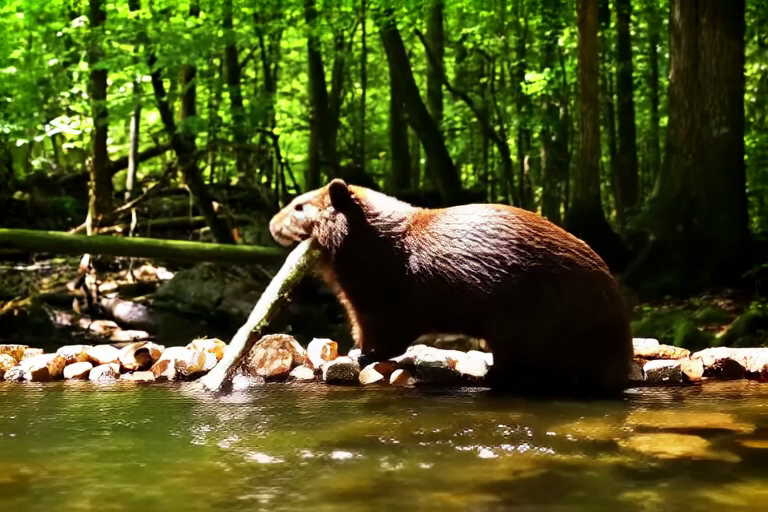
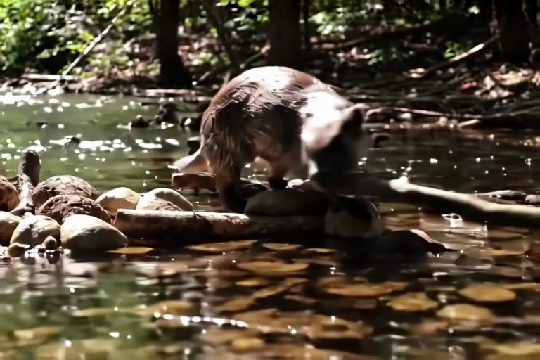
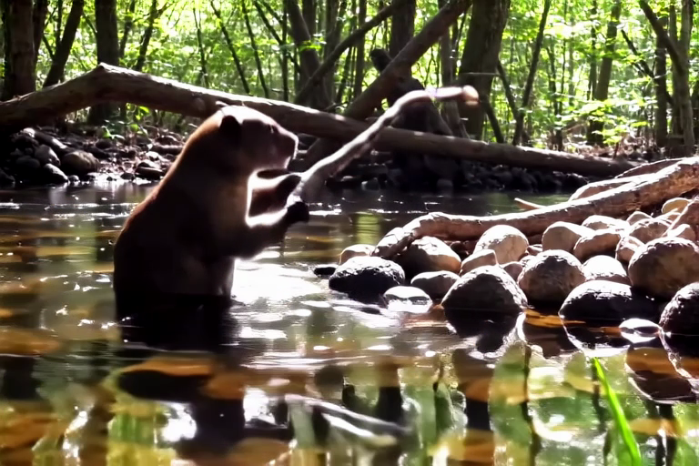
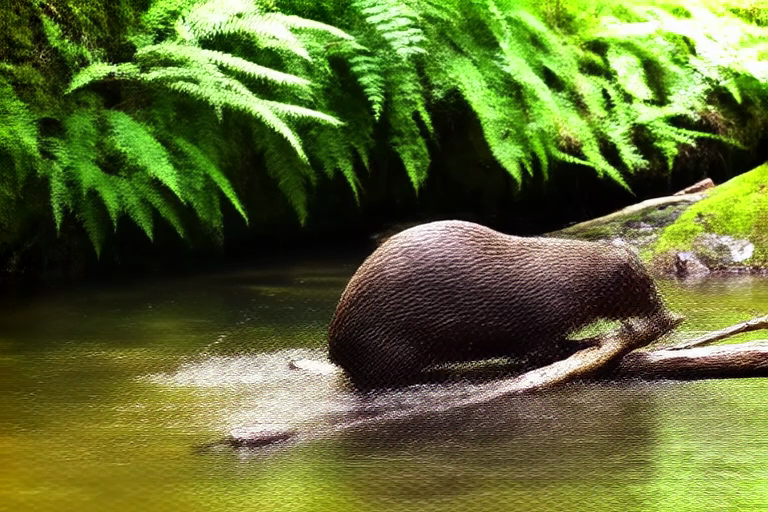
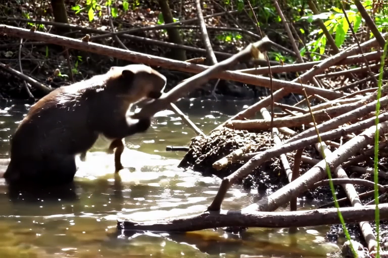
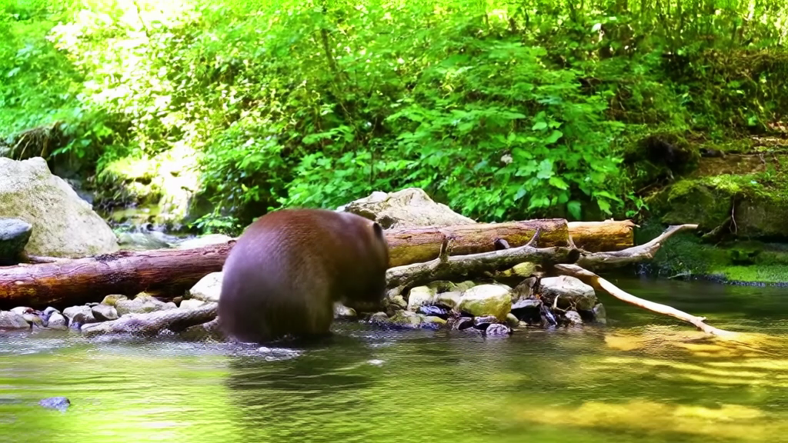
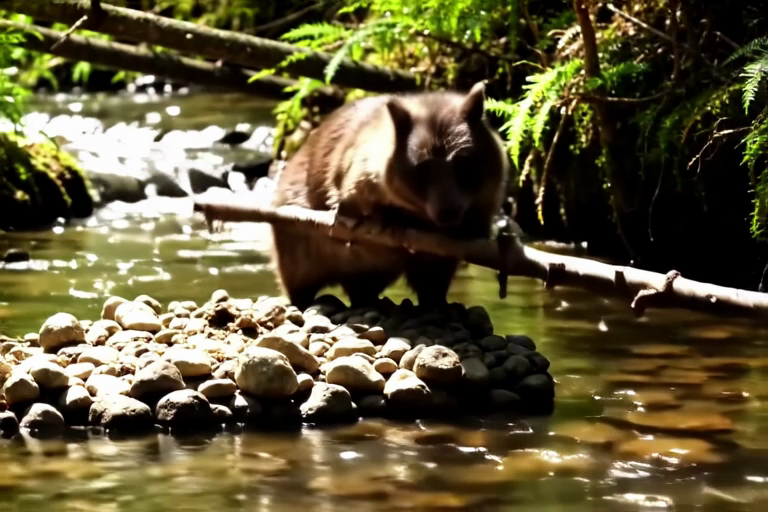

# Beaver Dam — 8 Configuration Comparison

**Prompt**: *"A beaver building a dam in a forest stream, detailed fur, water splashing, natural lighting"*

All videos generated with: `--enhance-prompt --seed 42 --profile --debug -f 121` (5 seconds at 24fps)

## Performance Summary

| # | Configuration | Model | Steps | CFG | Resolution | Time | Peak RAM | Mean RAM |
|---|---------------|-------|-------|-----|------------|------|----------|----------|
| 1 | Distilled | distilled | 8 | 1.0 | 768x512 | 363s | 71 GB | 27 GB |
| 2 | Dev | dev | 40 | 4.0 | 768x512 | 3220s | 71 GB | 27 GB |
| 3 | Dev + LoRA | dev + distilled LoRA | 8 | 1.0 | 768x512 | 318s | 71 GB | 27 GB |
| 4 | Distilled + Upscaler | distilled | 8+3 | 1.0 | 384x256 -> 768x512 | 217s | 73 GB | 28 GB |
| 5 | Dev + Upscaler | dev | 40+3 | 4.0 | 384x256 -> 768x512 | 775s | 73 GB | 27 GB |
| 6 | **Dev + LoRA + Upscaler** | dev + distilled LoRA | 8+3 | 1.0 | 384x256 -> 768x512 | **191s** | 73 GB | 28 GB |
| 7 | Dev 1024x576 | dev | 40 | 4.0 | 1024x576 | 5039s | 91 GB | 27 GB |
| 8 | Distilled qint8 | distilled (8-bit) | 8 | 1.0 | 768x512 | 284s | 59 GB | **15 GB** |

> **Note on #5**: Dev + Upscaler without distilled LoRA produces visible noise artifacts. This is a model limitation, not a code bug — see [Why two-stage requires distilled LoRA](#why-two-stage-requires-distilled-lora) below.

> **Note on #8**: On-the-fly 8-bit quantization reduces mean denoising RAM by 44% (15 GB vs 27 GB) with faster per-step inference (30.9s vs 39.8s). Peak RAM is lower than bf16 because model weights are smaller after quantization.

> **Recommended**: #6 (Dev + LoRA + Upscaler) offers the best quality/speed ratio at 191s. For maximum quality at high resolution without two-stage, use #7 (Dev 1024, 5039s). For memory-constrained systems, use #8 (Distilled qint8, 15 GB mean).

*Hardware: Apple Silicon M3 Max 96GB. 121 frames (5 seconds at 24fps). Peak RAM includes model loading phase. Text encoder: Gemma 3 12B 4-bit QAT (VLM).*

## Video Comparison

### Single-stage

<table>
<tr>
<td align="center"><b>1. Distilled</b> (363s)</td>
<td align="center"><b>2. Dev</b> (3220s)</td>
<td align="center"><b>3. Dev + LoRA</b> (318s)</td>
</tr>
<tr>
<td><video src="https://github.com/VincentGourbin/ltx-video-swift-mlx/raw/main/docs/examples/beaver-dam/distilled.mp4" controls width="256"></video></td>
<td><video src="https://github.com/VincentGourbin/ltx-video-swift-mlx/raw/main/docs/examples/beaver-dam/dev.mp4" controls width="256"></video></td>
<td><video src="https://github.com/VincentGourbin/ltx-video-swift-mlx/raw/main/docs/examples/beaver-dam/dev-lora.mp4" controls width="256"></video></td>
</tr>
</table>

### Two-stage (with 2x spatial upscaler)

<table>
<tr>
<td align="center"><b>4. Distilled + Upscaler</b> (217s)</td>
<td align="center"><b>5. Dev + Upscaler</b> (775s) *</td>
<td align="center"><b>6. Dev + LoRA + Upscaler</b> (191s)</td>
</tr>
<tr>
<td><video src="https://github.com/VincentGourbin/ltx-video-swift-mlx/raw/main/docs/examples/beaver-dam/distilled-upscaler.mp4" controls width="256"></video></td>
<td><video src="https://github.com/VincentGourbin/ltx-video-swift-mlx/raw/main/docs/examples/beaver-dam/dev-upscaler.mp4" controls width="256"></video></td>
<td><video src="https://github.com/VincentGourbin/ltx-video-swift-mlx/raw/main/docs/examples/beaver-dam/dev-lora-upscaler.mp4" controls width="256"></video></td>
</tr>
</table>

\* *Video 5 exhibits noise artifacts — see [explanation below](#why-two-stage-requires-distilled-lora).*

### High resolution / Quantization

<table>
<tr>
<td align="center"><b>7. Dev 1024x576</b> (5039s)</td>
<td align="center"><b>8. Distilled qint8</b> (284s, 15 GB)</td>
</tr>
<tr>
<td><video src="https://github.com/VincentGourbin/ltx-video-swift-mlx/raw/main/docs/examples/beaver-dam/dev-1024x576.mp4" controls width="256"></video></td>
<td><video src="https://github.com/VincentGourbin/ltx-video-swift-mlx/raw/main/docs/examples/beaver-dam/distilled-qint8.mp4" controls width="256"></video></td>
</tr>
</table>

### Still Frame Comparison (Frame 12)

| Distilled | Dev | Dev + LoRA |
|-----------|-----|------------|
|  |  |  |

| Distilled + Upscaler | Dev + Upscaler * | Dev + LoRA + Upscaler |
|----------------------|------------------|------------------------|
|  |  |  |

| Dev 1024x576 | Distilled qint8 |
|--------------|-----------------|
|  |  |

---

## Why Two-Stage Requires Distilled LoRA

The two-stage pipeline's stage 2 uses **distilled refinement sigmas** `[0.909, 0.725, 0.422, 0.0]` — a 3-step schedule designed for the distilled model's learned denoising behavior.

The **dev model** (trained for 40-step CFG denoising with continuous sigma schedules) cannot properly denoise in just 3 steps with these fixed sigmas. The result is visible noise/grain in the output (video 5).

This matches the official Lightricks implementation:
- **HuggingFace Diffusers** always loads distilled LoRA before stage 2, even when using the dev model for stage 1
- **Lightricks HF Space** exclusively uses dev + distilled LoRA for the two-stage pipeline

**Working two-stage configurations:**
- Distilled + Upscaler (#4) — distilled model handles the distilled sigmas natively
- Dev + LoRA + Upscaler (#6) — distilled LoRA adapts dev weights for distilled-style denoising

**For high-resolution dev output without LoRA**, use single-stage at full resolution (#7), though at significantly higher compute cost (5039s vs 191s).

---

## On-The-Fly Quantization

Case #8 demonstrates **on-the-fly 8-bit quantization** (`--transformer-quant qint8`), which replaces all transformer `Linear` layers with `QuantizedLinear` after weight loading.

**Benefits:**
- **44% less RAM during denoising** (15 GB vs 27 GB mean) — enables generation on 16 GB Macs
- **22% faster per-step inference** (30.9s vs 39.8s) — less memory bandwidth needed
- **LoRA compatible** — uses dequant -> merge -> requant pattern

**Trade-offs:**
- Higher peak RAM during loading (bf16 weights + quantization overhead)
- Potential minor quality degradation from weight quantization

Available options: `--transformer-quant bf16` (default), `qint8` (8-bit), `int4` (4-bit).

---

## Detailed Results

### 1. Distilled

8 steps, no CFG. Fastest single-stage option.

```bash
ltx-video generate "A beaver building a dam in a forest stream, detailed fur, water splashing, natural lighting" \
    -m distilled --enhance-prompt --seed 42 --profile --debug \
    -w 768 -h 512 -f 121 -o docs/examples/beaver-dam/distilled.mp4
```

<video src="https://github.com/VincentGourbin/ltx-video-swift-mlx/raw/main/docs/examples/beaver-dam/distilled.mp4" controls width="512"></video>

<details>
<summary>Profiling output</summary>

```
Text Encoding (Gemma + FE + Connector): 17.7s
Denoising (8 steps):                 318.0s
  Step 0: 37.9s
  Step 1: 37.0s
  Step 2: 37.4s
  Step 3: 37.3s
  Step 4: 41.5s
  Step 5: 44.3s
  Step 6: 43.1s
  Step 7: 39.6s
  Average per step:                      39.8s
VAE Decoding:                            17.7s
Pipeline total (excl. loading/export):   353.4s

Peak GPU memory:                         70771 MB
Mean GPU memory (denoising):              27040 MB
```
</details>

---

### 2. Dev

40 steps with CFG 4.0. Best single-stage quality at 768x512.

```bash
ltx-video generate "A beaver building a dam in a forest stream, detailed fur, water splashing, natural lighting" \
    -m dev --enhance-prompt --seed 42 --profile --debug \
    -w 768 -h 512 -f 121 -o docs/examples/beaver-dam/dev.mp4
```

<video src="https://github.com/VincentGourbin/ltx-video-swift-mlx/raw/main/docs/examples/beaver-dam/dev.mp4" controls width="512"></video>

<details>
<summary>Profiling output</summary>

```
Text Encoding (Gemma + FE + Connector): 24.1s
Denoising (40 steps):                 3157.0s
  Step 0: 91.3s   Step 10: 72.3s   Step 20: 84.3s   Step 30: 78.3s
  Step 1: 88.3s   Step 11: 74.5s   Step 21: 81.9s   Step 31: 77.9s
  Step 2: 82.7s   Step 12: 74.0s   Step 22: 82.1s   Step 32: 76.3s
  Step 3: 83.6s   Step 13: 73.5s   Step 23: 82.3s   Step 33: 75.1s
  Step 4: 80.1s   Step 14: 75.2s   Step 24: 79.1s   Step 34: 76.5s
  Step 5: 79.2s   Step 15: 73.3s   Step 25: 83.3s   Step 35: 76.2s
  Step 6: 77.6s   Step 16: 73.7s   Step 26: 80.2s   Step 36: 74.3s
  Step 7: 76.3s   Step 17: 78.1s   Step 27: 79.5s   Step 37: 78.5s
  Step 8: 75.1s   Step 18: 78.4s   Step 28: 78.2s   Step 38: 73.8s
  Step 9: 73.1s   Step 19: 78.0s   Step 29: 78.1s   Step 39: 75.5s
  Average per step:                      78.9s
VAE Decoding:                            17.4s
Pipeline total (excl. loading/export):   3198.5s

Peak GPU memory:                         70778 MB
Mean GPU memory (denoising):              27047 MB
```
</details>

---

### 3. Dev + Distilled LoRA

Dev model weights with distilled LoRA fused in. 8 steps, no CFG — dev quality at distilled speed.

```bash
ltx-video generate "A beaver building a dam in a forest stream, detailed fur, water splashing, natural lighting" \
    --distilled-lora --enhance-prompt --seed 42 --profile --debug \
    -w 768 -h 512 -f 121 -o docs/examples/beaver-dam/dev-lora.mp4
```

<video src="https://github.com/VincentGourbin/ltx-video-swift-mlx/raw/main/docs/examples/beaver-dam/dev-lora.mp4" controls width="512"></video>

<details>
<summary>Profiling output</summary>

```
Text Encoding (Gemma + FE + Connector): 17.4s
Denoising (8 steps):                 275.0s
  Step 0: 36.3s
  Step 1: 34.5s
  Step 2: 33.2s
  Step 3: 33.2s
  Step 4: 34.2s
  Step 5: 35.2s
  Step 6: 34.4s
  Step 7: 34.0s
  Average per step:                      34.4s
VAE Decoding:                            17.2s
Pipeline total (excl. loading/export):   309.6s

Peak GPU memory:                         70771 MB
Mean GPU memory (denoising):              27040 MB
```
</details>

---

### 4. Distilled + Upscaler

Two-stage: distilled at 384x256, then upscale 2x and refine at 768x512.

```bash
ltx-video generate "A beaver building a dam in a forest stream, detailed fur, water splashing, natural lighting" \
    -m distilled --two-stage --enhance-prompt --seed 42 --profile --debug \
    -w 768 -h 512 -f 121 -o docs/examples/beaver-dam/distilled-upscaler.mp4
```

<video src="https://github.com/VincentGourbin/ltx-video-swift-mlx/raw/main/docs/examples/beaver-dam/distilled-upscaler.mp4" controls width="512"></video>

<details>
<summary>Profiling output</summary>

```
Text Encoding (Gemma + FE + Connector): 17.5s
Denoising (11 steps):                 175.0s
  Stage 1 (384x256, 8 steps):
    Step 0: 11.3s
    Step 1-7: ~9.5s each
  Stage 2 (768x512, 3 steps):
    Step 8: 35.4s
    Step 9: 33.1s
    Step 10: 32.3s
  Average per step:                      15.9s
VAE Decoding:                            17.4s
Pipeline total (excl. loading/export):   209.9s

Peak GPU memory:                         72675 MB
Mean GPU memory (denoising):              27508 MB
```
</details>

---

### 5. Dev + Upscaler (not recommended)

> **Warning**: This configuration produces visible noise artifacts. The dev model cannot properly refine in 3 steps with distilled sigmas. Use #6 (with LoRA) or #7 (single-stage 1024) instead. Kept here for reference to illustrate the limitation.

Two-stage: dev model (40 steps, CFG 4.0) at 384x256, then upscale 2x and refine at 768x512.

```bash
ltx-video generate "A beaver building a dam in a forest stream, detailed fur, water splashing, natural lighting" \
    -m dev --two-stage --steps 40 --guidance 4.0 --enhance-prompt --seed 42 --profile --debug \
    -w 768 -h 512 -f 121 -o docs/examples/beaver-dam/dev-upscaler.mp4
```

<video src="https://github.com/VincentGourbin/ltx-video-swift-mlx/raw/main/docs/examples/beaver-dam/dev-upscaler.mp4" controls width="512"></video>

<details>
<summary>Profiling output</summary>

```
Text Encoding (Gemma + FE + Connector): 24.2s
Denoising (43 steps):                 732.0s
  Stage 1 (384x256, 40 steps with CFG):
    Step 0: 20.1s  ... Step 39: 17.0s
    Average: ~16.2s/step
  Stage 2 (768x512, 3 steps):
    Step 40: 43.3s
    Step 41: 37.2s
    Step 42: 34.0s
  Average per step (all):                17.0s
VAE Decoding:                            17.5s
Pipeline total (excl. loading/export):   773.7s

Peak GPU memory:                         72690 MB
Mean GPU memory (denoising):              27143 MB
```
</details>

---

### 6. Dev + LoRA + Upscaler (Two-Stage)

The standard HuggingFace Space pipeline: dev model with distilled LoRA, 8 steps at 384x256, then upscale 2x and refine with 3 steps at 768x512. **Best quality/speed ratio.**

```bash
ltx-video generate "A beaver building a dam in a forest stream, detailed fur, water splashing, natural lighting" \
    --distilled-lora --two-stage --enhance-prompt --seed 42 --profile --debug \
    -w 768 -h 512 -f 121 -o docs/examples/beaver-dam/dev-lora-upscaler.mp4
```

<video src="https://github.com/VincentGourbin/ltx-video-swift-mlx/raw/main/docs/examples/beaver-dam/dev-lora-upscaler.mp4" controls width="512"></video>

<details>
<summary>Profiling output</summary>

```
Text Encoding (Gemma + FE + Connector): 17.5s
Denoising (11 steps):                 152.1s
  Stage 1 (384x256, 8 steps):
    Step 0: 10.7s
    Step 1-7: ~8.7s each
    Average: ~9.0s/step
  Stage 2 (768x512, 3 steps):
    Step 8: 33.1s
    Step 9: 29.5s
    Step 10: 31.5s
  Average per step:                      13.8s
VAE Decoding:                            17.2s
Pipeline total (excl. loading/export):   174.3s

Peak GPU memory:                         72675 MB
Mean GPU memory (denoising):              27508 MB
```
</details>

---

### 7. Dev 1024x576 (Single-Stage)

Dev model at full 1024x576 resolution. No upscaler needed — highest quality output, but significantly slower due to 9216 latent tokens (vs 6144 at 768x512). Attention scales quadratically with token count.

```bash
ltx-video generate "A beaver building a dam in a forest stream, detailed fur, water splashing, natural lighting" \
    -m dev --enhance-prompt --seed 42 --profile --debug \
    -w 1024 -h 576 -f 121 -o docs/examples/beaver-dam/dev-1024x576.mp4
```

<video src="https://github.com/VincentGourbin/ltx-video-swift-mlx/raw/main/docs/examples/beaver-dam/dev-1024x576.mp4" controls width="512"></video>

<details>
<summary>Profiling output</summary>

```
Text Encoding (Gemma + FE + Connector): 24.2s
Denoising (40 steps):                 4986.3s
  Step 0: 104.2s  Step 10: 151.8s  Step 20: 131.5s  Step 30: 115.8s
  Step 1: 100.1s  Step 11: 141.9s  Step 21: 125.3s  Step 31: 125.0s
  Step 2: 118.8s  Step 12: 107.3s  Step 22: 161.4s  Step 32: 120.5s
  Step 3: 140.6s  Step 13: 105.1s  Step 23: 140.5s  Step 33: 113.8s
  Step 4: 122.9s  Step 14: 116.7s  Step 24: 127.5s  Step 34: 111.5s
  Step 5: 127.5s  Step 15: 143.2s  Step 25: 133.6s  Step 35: 111.1s
  Step 6: 136.8s  Step 16: 126.2s  Step 26: 131.1s  Step 36: 118.3s
  Step 7: 110.1s  Step 17: 126.1s  Step 27: 128.6s  Step 37: 124.9s
  Step 8: 134.0s  Step 18: 113.8s  Step 28: 119.2s  Step 38: 118.9s
  Step 9: 153.1s  Step 19: 128.2s  Step 29: 108.5s  Step 39: 110.7s
  Average per step:                      124.7s
VAE Decoding:                            27.3s
Pipeline total (excl. loading/export):   5037.8s

Peak GPU memory:                         91377 MB
Mean GPU memory (denoising):              27099 MB
```
</details>

---

### 8. Distilled qint8 (8-bit Quantized)

Distilled model with on-the-fly 8-bit quantization. All transformer `Linear` layers are replaced with `QuantizedLinear` after weight loading. **44% less RAM during inference** with comparable quality.

```bash
ltx-video generate "A beaver building a dam in a forest stream, detailed fur, water splashing, natural lighting" \
    -m distilled --transformer-quant qint8 --enhance-prompt --seed 42 --profile --debug \
    -w 768 -h 512 -f 121 -o docs/examples/beaver-dam/distilled-qint8.mp4
```

<video src="https://github.com/VincentGourbin/ltx-video-swift-mlx/raw/main/docs/examples/beaver-dam/distilled-qint8.mp4" controls width="512"></video>

<details>
<summary>Profiling output</summary>

```
Transformer quantization:                1.3s (one-time, at load)
Text Encoding (Gemma + FE + Connector): 17.9s
Denoising (8 steps):                 247.1s
  Step 0: 30.4s
  Step 1: 30.4s
  Step 2: 31.5s
  Step 3: 31.1s
  Step 4: 30.6s
  Step 5: 30.8s
  Step 6: 31.1s
  Step 7: 31.3s
  Average per step:                      30.9s
VAE Decoding:                            17.9s
Pipeline total (excl. loading/export):   283.0s

Peak GPU memory:                         59115 MB
Mean GPU memory (denoising):              15384 MB
```
</details>

**Comparison with Distilled bf16 (#1):**

| Metric | bf16 (#1) | qint8 (#8) | Difference |
|--------|-----------|------------|------------|
| Mean RAM (denoising) | 27 GB | 15 GB | **-44%** |
| Average step time | 39.8s | 30.9s | **-22%** |
| Peak RAM | 71 GB | 59 GB | -17% |
| Total pipeline time | 363s | 284s | **-22%** |

---

## Reproduction

All commands can be run sequentially. Models are auto-downloaded on first run (~20-25 GB depending on variant).

To extract comparison frames:
```bash
for f in distilled dev dev-lora distilled-upscaler dev-upscaler dev-lora-upscaler dev-1024x576 distilled-qint8; do
    ffmpeg -i docs/examples/beaver-dam/$f.mp4 \
        -vf "select=eq(n\,12)" -vframes 1 \
        docs/examples/beaver-dam/frames/${f}_frame_12.png
done
```
