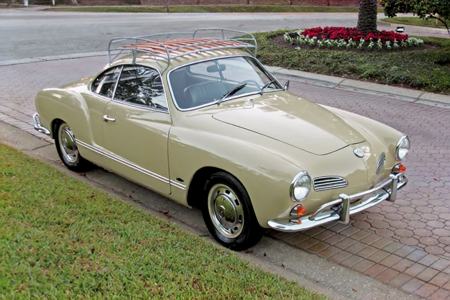
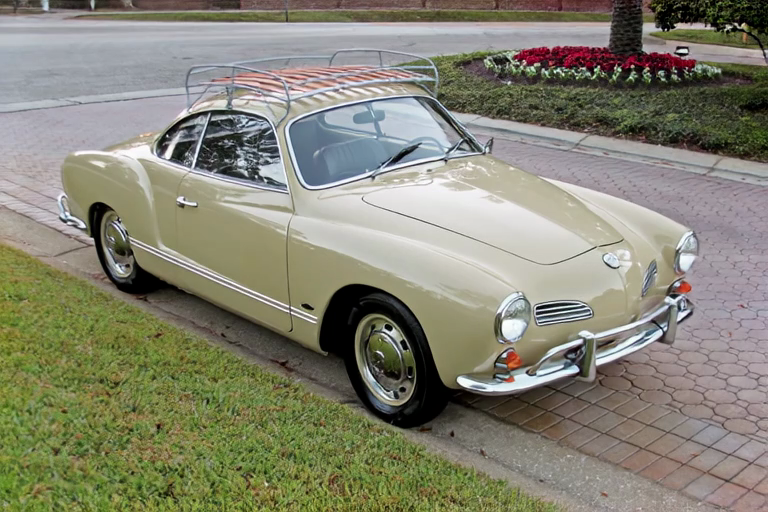
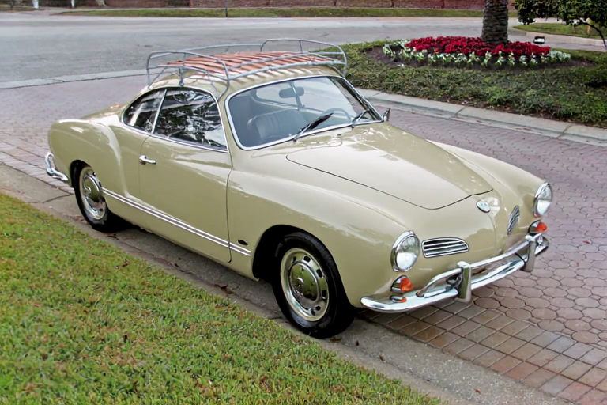
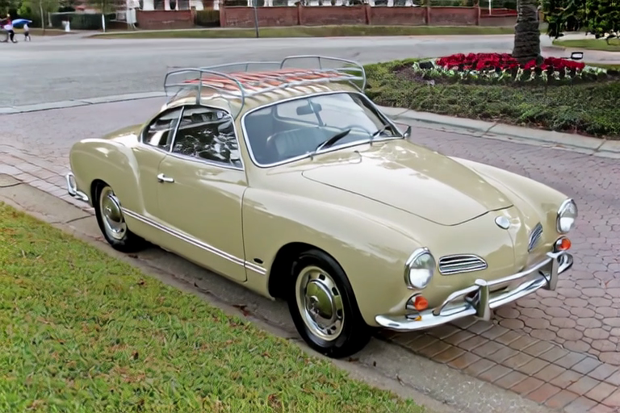
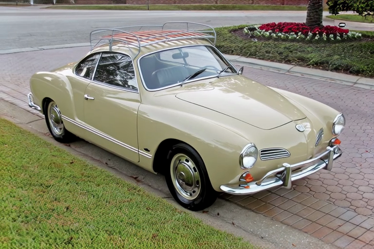
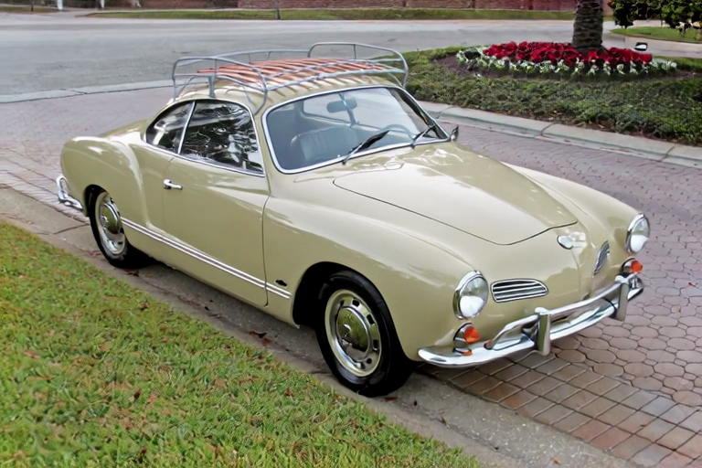
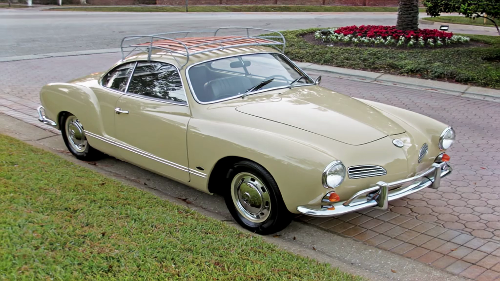
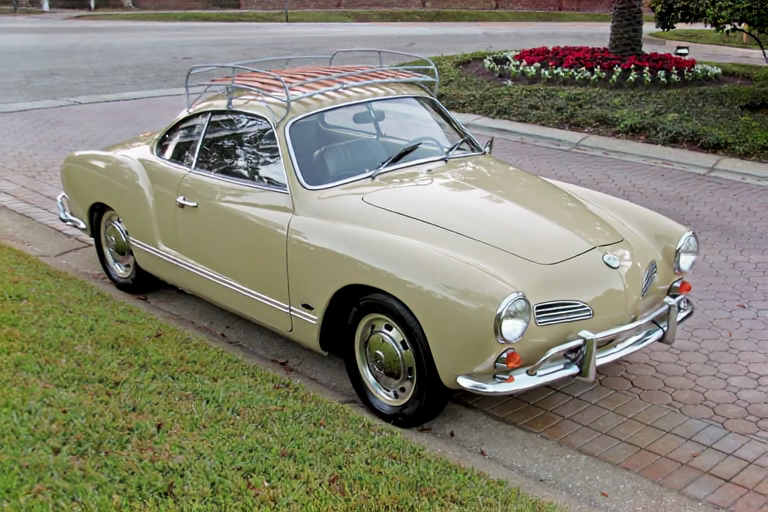

# Flying Car — 8 Configuration Comparison (Image-to-Video + Audio)

**Input Image**: [example_input.png](../example_input.png) (Volkswagen Karmann Ghia)
**Prompt**: *"make this car fly"* (enhanced via multimodal VLM — Gemma sees the input image)

All videos generated with: `--image ../example_input.png --audio --enhance-prompt --seed 42 --profile -f 121` (5 seconds at 24fps, stereo audio at 24kHz)

## Performance Summary

| # | Configuration | Model | Steps | CFG | Resolution | Time |
|---|---------------|-------|-------|-----|------------|------|
| 1 | Distilled | distilled | 8 | 1.0 | 768x512 | ~350s |
| 2 | Dev | dev | 40 | 3.0 | 768x512 | 1600s |
| 3 | Dev + LoRA | dev + distilled LoRA | 8 | 1.0 | 768x512 | 309s |
| 4 | Distilled + Upscaler | distilled | 8+3 | 1.0 | 384x256 -> 768x512 | 216s |
| 5 | Dev + Upscaler | dev (distilled sched.) | 8+3 | 1.0 | 384x256 -> 768x512 | 225s |
| 6 | **Dev + LoRA + Upscaler** | dev + distilled LoRA | 8+3 | 1.0 | 384x256 -> 768x512 | 216s |
| 7 | Dev 1024x576 | dev | 40 | 3.0 | 1024x576 | 2479s |
| 8 | Distilled qint8 | distilled (8-bit) | 8 | 1.0 | 768x512 | 341s |

> All cases include dual video/audio generation. Audio adds ~5-10% overhead to generation time.

> **Note on #5**: Dev + Upscaler without distilled LoRA produces visible noise artifacts. This is a model limitation, not a code bug.

> **Recommended**: #6 (Dev + LoRA + Upscaler) offers the best quality/speed ratio. For maximum quality at high resolution, use #7 (Dev 1024).

*Hardware: Apple Silicon M3 Max 96GB. 121 frames (5 seconds at 24fps). Audio: stereo 24kHz, muxed into MP4.*

## Video Comparison

### Single-stage

<table>
<tr>
<td align="center"><b>1. Distilled</b></td>
<td align="center"><b>2. Dev</b></td>
<td align="center"><b>3. Dev + LoRA</b></td>
</tr>
<tr>
<td><video src="https://github.com/VincentGourbin/ltx-video-swift-mlx/raw/main/docs/examples/flying-car/distilled.mp4" controls width="256"></video></td>
<td><video src="https://github.com/VincentGourbin/ltx-video-swift-mlx/raw/main/docs/examples/flying-car/dev.mp4" controls width="256"></video></td>
<td><video src="https://github.com/VincentGourbin/ltx-video-swift-mlx/raw/main/docs/examples/flying-car/dev-lora.mp4" controls width="256"></video></td>
</tr>
</table>

### Two-stage (with 2x spatial upscaler)

<table>
<tr>
<td align="center"><b>4. Distilled + Upscaler</b></td>
<td align="center"><b>5. Dev + Upscaler</b> *</td>
<td align="center"><b>6. Dev + LoRA + Upscaler</b></td>
</tr>
<tr>
<td><video src="https://github.com/VincentGourbin/ltx-video-swift-mlx/raw/main/docs/examples/flying-car/distilled-upscaler.mp4" controls width="256"></video></td>
<td><video src="https://github.com/VincentGourbin/ltx-video-swift-mlx/raw/main/docs/examples/flying-car/dev-upscaler.mp4" controls width="256"></video></td>
<td><video src="https://github.com/VincentGourbin/ltx-video-swift-mlx/raw/main/docs/examples/flying-car/dev-lora-upscaler.mp4" controls width="256"></video></td>
</tr>
</table>

\* *Video 5 exhibits noise artifacts — see [beaver-dam explanation](../beaver-dam/README.md#why-two-stage-requires-distilled-lora).*

### High resolution / Quantization

<table>
<tr>
<td align="center"><b>7. Dev 1024x576</b></td>
<td align="center"><b>8. Distilled qint8</b></td>
</tr>
<tr>
<td><video src="https://github.com/VincentGourbin/ltx-video-swift-mlx/raw/main/docs/examples/flying-car/dev-1024x576.mp4" controls width="256"></video></td>
<td><video src="https://github.com/VincentGourbin/ltx-video-swift-mlx/raw/main/docs/examples/flying-car/distilled-qint8.mp4" controls width="256"></video></td>
</tr>
</table>

### Still Frame Comparison (Frame 12)

| Distilled | Dev | Dev + LoRA |
|-----------|-----|------------|
|  |  |  |

| Distilled + Upscaler | Dev + Upscaler * | Dev + LoRA + Upscaler |
|----------------------|------------------|------------------------|
|  |  |  |

| Dev 1024x576 | Distilled qint8 |
|--------------|-----------------|
|  |  |

---

## Detailed Results

### 1. Distilled

8 steps, no CFG. Fastest single-stage option.

```bash
ltx-video generate --image docs/examples/example_input.png --audio --enhance-prompt --seed 42 --profile \
    -m distilled -w 768 -h 512 -f 121 -o docs/examples/flying-car/distilled.mp4 "make this car fly"
```

---

### 2. Dev

40 steps with CFG 3.0. Best single-stage quality at 768x512.

```bash
ltx-video generate --image docs/examples/example_input.png --audio --enhance-prompt --seed 42 --profile \
    -m dev -w 768 -h 512 -f 121 -o docs/examples/flying-car/dev.mp4 "make this car fly"
```

---

### 3. Dev + Distilled LoRA

Dev model weights with distilled LoRA fused in. 8 steps, no CFG.

```bash
ltx-video generate --image docs/examples/example_input.png --audio --enhance-prompt --seed 42 --profile \
    --distilled-lora -w 768 -h 512 -f 121 -o docs/examples/flying-car/dev-lora.mp4 "make this car fly"
```

---

### 4. Distilled + Upscaler

Two-stage: distilled at 384x256, then upscale 2x and refine at 768x512.

```bash
ltx-video generate --image docs/examples/example_input.png --audio --enhance-prompt --seed 42 --profile \
    -m distilled --two-stage -w 768 -h 512 -f 121 -o docs/examples/flying-car/distilled-upscaler.mp4 "make this car fly"
```

---

### 5. Dev + Upscaler (not recommended)

> **Warning**: This configuration produces visible noise artifacts. Use #6 (with LoRA) or #7 (single-stage 1024) instead.

```bash
ltx-video generate --image docs/examples/example_input.png --audio --enhance-prompt --seed 42 --profile \
    -m dev --two-stage --steps 40 --guidance 4.0 -w 768 -h 512 -f 121 -o docs/examples/flying-car/dev-upscaler.mp4 "make this car fly"
```

---

### 6. Dev + LoRA + Upscaler (Two-Stage)

The standard HuggingFace Space pipeline. **Best quality/speed ratio.**

```bash
ltx-video generate --image docs/examples/example_input.png --audio --enhance-prompt --seed 42 --profile \
    --distilled-lora --two-stage -w 768 -h 512 -f 121 -o docs/examples/flying-car/dev-lora-upscaler.mp4 "make this car fly"
```

---

### 7. Dev 1024x576 (Single-Stage)

Dev model at full 1024x576 resolution. Highest quality, significantly slower.

```bash
ltx-video generate --image docs/examples/example_input.png --audio --enhance-prompt --seed 42 --profile \
    -m dev -w 1024 -h 576 -f 121 -o docs/examples/flying-car/dev-1024x576.mp4 "make this car fly"
```

---

### 8. Distilled qint8 (8-bit Quantized)

Distilled model with on-the-fly 8-bit quantization. ~44% less RAM during inference.

```bash
ltx-video generate --image docs/examples/example_input.png --audio --enhance-prompt --seed 42 --profile \
    -m distilled --transformer-quant qint8 -w 768 -h 512 -f 121 -o docs/examples/flying-car/distilled-qint8.mp4 "make this car fly"
```

---

## Reproduction

All commands can be run sequentially using the generation script:
```bash
bash docs/examples/flying-car/generate-all.sh
```

Models are auto-downloaded on first run (~20-25 GB depending on variant).

To extract comparison frames:
```bash
for f in distilled dev dev-lora distilled-upscaler dev-upscaler dev-lora-upscaler dev-1024x576 distilled-qint8; do
    ffmpeg -i docs/examples/flying-car/$f.mp4 \
        -vf "select=eq(n\,12)" -vframes 1 \
        docs/examples/flying-car/frames/${f}_frame_12.png
done
```
