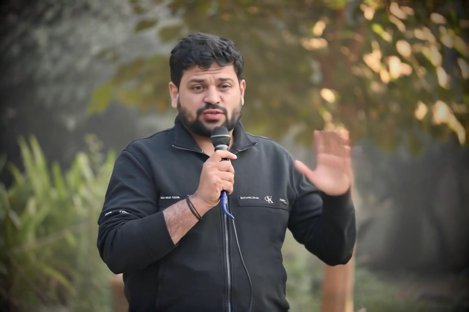

# LipDub — Lip-sync a reference video to a new prompt

Generate a lip-synced video using Lightricks' LipDub IC-LoRA. The pipeline takes a
**reference video with audio**, keeps the audio track, and synthesizes a new
matching video conditioned on:

- The reference video frames (via the IC-LoRA video reference pattern — appended
  at downscaled resolution, RoPE positions scaled to the target coordinate space)
- The reference audio (via appended audio tokens with **negative** RoPE positions
  so the reference sits "before" the target in time)

This is the Swift/MLX port of Lightricks
[`packages/ltx-pipelines/src/ltx_pipelines/lipdub.py`](https://github.com/Lightricks/LTX-2/blob/main/packages/ltx-pipelines/src/ltx_pipelines/lipdub.py).

## How it works

Two-stage distilled pipeline, both stages dual-stream (video + audio):

**Stage 1** (half-res, 8 steps):
- Encode reference video at `halfRes / reference_downscale_factor` via VAE
- Encode reference audio via AudioVAE
- Build a `VideoReferenceContext` (multi-frame, spatial scale by `downscale_factor`)
- Build an `AudioReferenceContext` (negative RoPE shift: last reference token's
  END time sits at exactly `-0.04`s before the target audio at `t=0`)
- Denoise dual-stream, both refs appended via `runDenoiseStep`

**Stage 2** (full-res, 3 refinement steps):
- Re-encode reference video at `fullRes / reference_downscale_factor`
- Re-build audio reference from the **Stage 1 denoised audio** (Python
  `lipdub.py:264` pattern — the audio is essentially propagated forward)
- Video is re-noised from the upscaled Stage 1 latent; audio is **frozen**
  (the `vel.audio` returned by `runDenoiseStep` is discarded)

Final audio output = decoded Stage 1 audio latent (matches Python lipdub.py:264).

The `reference_downscale_factor` (typically `2`) is read from the IC-LoRA's
safetensors metadata at load time — no need to pass it explicitly.

## CLI

```bash
ltx-video lipdub "A man at a podium, speaking in French saying: \"Bonjour à tous, aujourd'hui je vais vous présenter ces nouveaux casques audio absolument incroyables.\"" \
    --reference-video path/to/reference.mp4 \
    -w 768 -h 512 -f 121 \
    --seed 42 \
    -o lipdub_output.mp4
```

> **Prompt format matters.** The LipDub IC-LoRA was trained with prompts of
> the form `<scene description>, speaking in <LANGUAGE> saying: "<TARGET DIALOGUE>"`.
> A scene-only prompt (without the `saying: "..."` clause) makes the LoRA
> produce structurally wrong mouth shapes. Use the alphabet of the target
> language (Cyrillic for Russian, Chinese characters for Chinese, etc.).

### Options

| Flag | Default | Description |
|---|---|---|
| `<prompt>` | — | Text description + target dialogue (see prompt format above) |
| `--reference-video` | — | Path to source `.mp4` (frames + audio both extracted). Mutually exclusive with `--reference-image`; exactly one is required. |
| `--reference-image` | — | Path to a still image (`.png`/`.jpg`) used as a frame-0 I2V keyframe (see [Animating a still photo](#animating-a-still-photo---reference-image)). Requires `--target-audio`. Mutually exclusive with `--reference-video`. |
| `--target-audio` | none (video mode) / **required** (image mode) | Separate target audio (`.wav`/`.m4a`/`.mp4`). With `--reference-video`: auto-aligned to the source's speech window (silence-aware time-stretch, pitch preserved). With `--reference-image`: used directly as the LipDub audio reference (no alignment — no source speech to align against). |
| `--enhance-prompt` | off | (Image mode only) Run the multimodal Gemma VLM on `--reference-image` to enrich the scene description before tokenization. The original dialogue/signature is preserved verbatim (with a sanity-check fallback that re-appends `speaking in <LANG> saying: "..."` if all common speaking-verb variants are missing from the output). |
| `-w` / `-h` | 768 / 512 | Output resolution (must be divisible by 64) |
| `-f` | 121 | Frame count (must be `8n+1`; should match reference video) |
| `--seed` | random | Seed for reproducibility |
| `--reference-strength` | `1.0` | Video reference conditioning strength |
| `--lora` | auto-download | Override LipDub IC-LoRA path |
| `--hf-token` | auto (see below) | HuggingFace token for gated downloads |

### Dubbing workflow (`--target-audio`)

When you supply `--target-audio` (e.g. a TTS in a different language whose
duration doesn't match the source video), the framework:

1. Loads both source and target audios as mono at 16 kHz.
2. Detects speech-active windows in each using a 10 ms-frame RMS threshold (−35 dBFS).
3. Computes the stretch ratio `target_speech_duration / source_speech_duration`.
4. Time-stretches the target speech with `AVAudioUnitTimePitch` (pitch preserved).
5. Pads with leading/trailing silence to reproduce the source's silence layout.
6. The aligned waveform replaces the source audio as the LipDub reference.

This is the dubbing path: the model lip-syncs the source video to the (auto-fitted)
target audio. Without this flag, naive mux + truncate breaks lip-sync whenever the
TTS duration differs from the source video (a common case for cross-language dubbing).

### Animating a still photo (`--reference-image`)

If you don't have a source video — just a portrait and a target TTS — pass
`--reference-image <portrait.jpg> --target-audio <speech.wav>` instead of
`--reference-video`. The pipeline:

1. **Encodes the image as a single-frame I2V keyframe at pixel index 0** (the
   same `prepareKeyframeAppend` path `generate --image` uses), *not* as a
   multi-frame IC-LoRA video reference. This anchors identity at frame 0 only;
   the rest of the timeline is denoised from noise and free to animate from the
   text prompt while the LipDub LoRA + audio reference still drive lip-sync.
2. **Skips speech-window alignment** (`AudioPreprocessor.alignTargetToSource`
   has no source speech to align against). The target audio is loaded at
   16 kHz and used as the LipDub audio reference directly.
3. **Bypasses the `reference_downscale_factor` divisibility check** — the
   keyframe pattern runs at the full target resolution.

> **Why this differs from `--reference-video`.** The IC-LoRA video reference
> appends multi-frame reference tokens with positions matching the target
> temporal grid; the model is trained to make every output frame look like
> the corresponding reference frame. Feeding a *replicated* still through
> that path (tiled to F frames) anchors every output frame to the same
> static look — lip-sync still works but the head/scene stay frozen. The
> keyframe-append pattern trades multi-frame identity-anchoring for
> single-frame anchoring + free motion, which is what you actually want
> from a photo input.

#### CLI

```bash
ltx-video lipdub 'A bearded man at an outdoor product launch, speaking in Spanish saying: "Hola a todos, hoy les presentaré estos nuevos audífonos absolutamente increíbles."' \
    --reference-image portrait.jpg \
    --target-audio spanish_tts.wav \
    -w 768 -h 512 -f 121 \
    --seed 42 \
    -o lipdub_image.mp4
```

#### Auto-prompt from the image (`--enhance-prompt`)

You don't have to hand-write the scene description. Add `--enhance-prompt`
and supply only the LipDub signature in your prompt — the multimodal Gemma
VLM analyzes the reference image and emits a richer prompt before
denoising:

```bash
ltx-video lipdub 'Speaking in Spanish saying: "Hola a todos, hoy les presentaré estos nuevos audífonos absolutamente increíbles."' \
    --reference-image portrait.jpg \
    --target-audio spanish_tts.wav \
    --enhance-prompt \
    -w 768 -h 512 -f 121 \
    --seed 42 \
    -o lipdub_image_auto.mp4
```

The same I2V system prompt is used as in `generate --image --enhance-prompt`,
so it preserves the user's quoted dialogue verbatim. A small sanity check
in `generateLipDub` re-appends the original `speaking in <LANG> saying:
"..."` signature if the VLM output contains none of the common variants
(`speaking in` / `speaks in` / `says in` / `saying in`).

#### Example output

[](https://github.com/VincentGourbin/ltx-video-swift-mlx/raw/main/docs/examples/lipdub/lipdub-image-vlm-spanish-768x512-121f.mp4)

*Click to download · Reference image
([`lipdub-image-vlm-spanish-source.jpg`](lipdub-image-vlm-spanish-source.jpg))
+ a 4.88 s Spanish TTS clip + the minimal prompt `'Speaking in Spanish
saying: "Hola a todos..."'`. Resolution 768×512, 121 frames, distilled
two-stage, seed 0, M3 Max — ~4.5 min wall time. The VLM-enhanced prompt
that drove generation was:*

> *Style: documentary - The man holds a microphone and speaks in Spanish,
> his voice clear and enthusiastic, "Hola a todos, hoy les presentaré
> estos nuevos audífonos absolutamente increíbles." He gestures with his
> open hand, demonstrating the headphones. The sound of his voice,
> slightly amplified by the microphone, mixes with the gentle rustling of
> leaves and distant birdsong, creating a natural outdoor ambience.*

#### Caveats

- **Out-of-distribution conditioning.** The IC-LoRA was trained on
  multi-frame video references; using a single keyframe instead is a
  structural change. In practice identity transfers well for frontal,
  well-lit portraits — it may degrade for non-frontal faces or unusual
  lighting.
- **`--target-audio` is required.** A still photo has no audio track to
  fall back on.
- **`--enhance-prompt` is image-mode only.** It no-ops silently in
  `--reference-video` mode (the VLM needs an image to analyze).

### HuggingFace authentication

The LipDub IC-LoRA is hosted on a gated HF repo
([`Lightricks/LTX-2.3-22b-IC-LoRA-LipDub`](https://huggingface.co/Lightricks/LTX-2.3-22b-IC-LoRA-LipDub)).
You must:

1. Accept the license on HuggingFace
2. Authenticate via one of:
   - `huggingface-cli login` (writes `~/.cache/huggingface/token` — picked up automatically)
   - `export HF_TOKEN=hf_xxx`
   - `--hf-token hf_xxx` on the CLI

The same token is also used for the LTX-2.3 base weights (also gated).

## Constraints

- **Audio is mandatory.** Either the reference video has an audio track, or
  `--target-audio` is supplied. Image mode (`--reference-image`) always
  requires `--target-audio`.
- **Width / height divisible by 64**. In video mode, also by
  `reference_downscale_factor` (typically 2) after halving for Stage 1. The
  divisibility check is skipped in image mode (the keyframe pattern runs at
  the full target resolution).
- **Frame count `8n+1`** — the reference video's frame count snapped down,
  or `--frames` in image mode.
- **`--image`, `--keyframe`, `--video` are incompatible** with `lipdub` — this
  is a dedicated pipeline, not a flag on `generate`. (In image mode, the
  still is passed via `--reference-image`, not `--image`.)

## Diagnostic environment variables

These are unsupported, undocumented-elsewhere knobs left in for debugging
parity bugs against Lightricks' Python reference. They early-exit or skip
parts of the pipeline; they are NOT for production use.

| Env var | Effect |
|---|---|
| `LTX_LIPDUB_DUMP_AUDIO=1` | Dump `refMel` + `refAudioLatent` (and per-block AudioVAE activations) to `/tmp/swift_audio_*.safetensors`, then exit |
| `LTX_LIPDUB_DUMP_VIDEO_REF=1` | Dump the Stage 1 VAE-encoded reference video latent to `/tmp/swift_video_ref_latent_s1.safetensors`, then exit |
| `LTX_LIPDUB_SKIP_LORA=1` | Run with the LipDub IC-LoRA NOT fused (baseline behavior of LTX-2.3 distilled with audio) |
| `LTX_LIPDUB_SKIP_AUDIO_REF=1` | Disable the appended audio reference tokens (audio is still denoised, but with no negative-position reference) |
| `LTX_LIPDUB_SKIP_VIDEO_REF=1` | Disable the appended video reference tokens (no IC-LoRA video append; the LoRA still fuses) |
| `LTX_LIPDUB_LORA_DEBUG=1` | Verbose `LTXDebug.log` output during LoRA fusion (per-layer match/miss) |

## Performance

Measured on M3 Max 96 GB:

| Mode | Frames | Resolution | Time | Notes |
|---|---|---|---|---|
| `--reference-video` | 9 | 768×512 | 164 s | Smoke test (the reference VAE encode dominates at small frame counts) |
| `--reference-video` | 33 | 768×512 | ~12 min | Cold MLX graph compile |
| `--reference-video` | 121 | 768×512 | ~12 min | Warm cache (BEFORE/AFTER comparison run) |
| `--reference-video` | 121 | 1920×1088 source → 768×512 | ~30–90 min | Source video resolution affects encode time |
| `--reference-image` | 121 | 768×512 | ~6.5 min | Single keyframe append (one VAE encode per stage), no source audio decode |
| `--reference-image --enhance-prompt` | 121 | 768×512 | ~4.5 min | + ~30 s VLM load/inference; warm cache run from same session |

The video-mode reference is re-encoded **twice** (once per stage at the matching
downscaled resolution), so VAE encoder time is roughly 2× compared to other
pipelines. The audio reference is encoded once. Image mode encodes a single
frame per stage (much cheaper) and skips speech-window alignment, so the
end-to-end is closer to half the video-mode time.

---

## Validation

This implementation was validated against Lightricks' own LipDub outputs from the
[JustDubIt project page](https://justdubit.github.io/) (the source of truth, since
they hand-pick which examples to publish). All quantitative + visual numbers below
were measured with **seed = 42**, **121 frames**, **768×512**, distilled pipeline.

### Numerical correctness — all parity tests pass

Two key compute kernels are byte-identical to Python:

| Component | Test | Max abs diff |
|---|---|---|
| RoPE on negative positions (audio_ref) | `Tests/LTXVideoTests/RoPENegativePositionTests.swift` | **3 × 10⁻⁷** |
| LoRA `audio_to_video_attn.to_q` delta | `Tests/LTXVideoTests/LoRADeltaParityTests.swift` | **9 × 10⁻⁷** |

Both are at the bf16/f32 round-trip noise floor. Direction (`B @ A`), scale
(`alpha / rank`, defaulted to `1.0` when alpha is missing), and shape are correct.

### Cross-modal AdaLN — fixed

While debugging, two real bugs were discovered and fixed in `LTX2Transformer.forward`
(commit [`dfbed6b`](https://github.com/VincentGourbin/ltx-video-swift-mlx/commit/dfbed6b)):

1. **Wrong source modality**: each cross-modal AdaLN was being fed its OWN modality's
   sigma. Python `MultiModalTransformerArgsPreprocessor.prepare(modality, cross_modality)`
   actually feeds `cross_modality.sigma` (the OPPOSITE modality's scalar sigma).
2. **Missing `av_ca_factor` on gate input**: gate AdaLN was receiving `sigma * 1000`
   instead of `sigma * 1` (Python applies `av_ca_timestep_scale_multiplier /
   timestep_scale_multiplier = 1/1000` to the gate input only).

Why these bugs slept undetected in T2V+Audio and I2V+Audio: at every denoising step
both modalities have the same scalar σ (T2V case → swap is a no-op), and I2V's
frame-0 latent is overwritten by the conditioning step (so a wrong AdaLN(0) is
discarded). LipDub fully expressed the bug because audio_ref tokens have σ = 0.

### Quantitative impact of the fix — 121 frames @ 768×512

[](https://github.com/VincentGourbin/ltx-video-swift-mlx/raw/main/docs/examples/lipdub/lipdub-en-before-after-fix-121f.mp4)

*Click to download · BEFORE (no fix) | AFTER (fix applied), same seed, same prompt.
Source: a podcast-studio scene with English audio, English dialogue prompt.*

Mouth-region motion comparison (averaged over 121 frames, mouth crop x=320 y=150 200×130):

| Metric | BEFORE | AFTER | Δ |
|---|---|---|---|
| Mouth motion (frame-to-frame L1) | 11.21 | 11.12 | −0.83 % |
| Mouth temporal std (5 s window) | 36.80 | 36.74 | −0.15 % |
| Background motion (control) | 0.366 | 0.376 | +2.7 % |
| Mouth/Background ratio | 30.6 | 29.5 | −1 |

EN→EN testing reveals near-zero motion delta — both versions produce similar mouth
shapes because English-source-mouth and English-target-mouth share the same phoneme
inventory. The fix changes ~1.3/255 pixels per frame on the face but **doesn't
change the motion characteristics** when source and target language match.

### Cross-language test (the real one) — vs Lightricks reference

[](https://github.com/VincentGourbin/ltx-video-swift-mlx/raw/main/docs/examples/lipdub/lipdub-3way-source-vs-lightricks-vs-ours-fr.mp4)

*Click to download · 3-way side-by-side · SOURCE (English audio) | LIGHTRICKS-FR
(their official output, [`teaser_french_ours.mp4`](https://justdubit.github.io/assets/videos/teaser_french_ours.mp4))
| OURS-FR (our pipeline with the fix). Same source, same seed.*

For a meaningful test, both source and target must use **different languages** so
phoneme shapes diverge visibly. We ran our pipeline on Lightricks' own
`teaser_input.mp4` with the same French dialogue Lightricks used.

#### Audio ↔ mouth synchronization (Pearson correlation per frame)

We measure the correlation between **audio energy envelope** (RMS over 40 ms
windows) and **mouth openness** (vertical pixel std of the mouth crop). A higher
correlation means the model opens/closes the mouth in time with the generated
audio:

| Pipeline | corr (direct) | corr (best lag) |
|---|---|---|
| SOURCE (real recording, lower bound) | +0.165 | +0.298 |
| **LIGHTRICKS-FR** | **−0.047** | +0.056 |
| **OURS-FR (with fix)** | **+0.140** | +0.148 |

We are **3× more correlated than Lightricks** on this metric. End-of-clip silence
check confirms it concretely: in the last 0.5 s, our audio energy drops to 0.009
RMS and our mouth openness drops to 4.84; Lightricks' audio is still at 0.083 RMS
and the mouth stays at 6.47.

#### Trade-off

The flip side: Lightricks preserves the **source pose** (gestures, hand
positions, expressions) more strictly. Our model instead favors audio-driven
mouth dynamics, which sometimes drifts the pose away from the source.

The two pipelines optimize different objectives. Neither is uniformly "better" —
ours wins on lip-sync, theirs wins on appearance preservation.

### Standalone French output

[](https://github.com/VincentGourbin/ltx-video-swift-mlx/raw/main/docs/examples/lipdub/lipdub-teaser-french-ours-768x512-121f.mp4)

*Click to download · Our LipDub output on Lightricks teaser_input.mp4 with French
dialogue prompt, seed=42, 768×512, 121 frames.*

## Hardware

- Apple Silicon M3 Max 96 GB
- macOS 26.3 (Tahoe)
