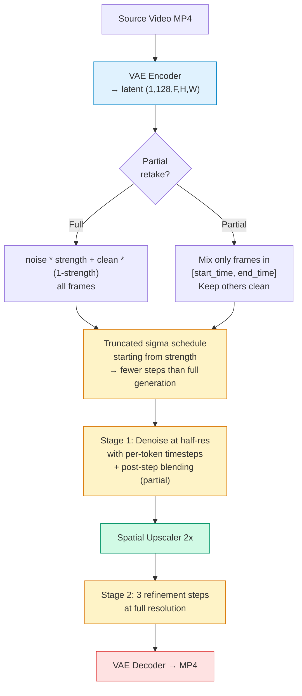

# Video-to-Video (Retake) — LTX-2.3 Distilled Two-Stage Pipeline

Retake regenerates a video (or part of it) with a new prompt while preserving temporal structure from the source.

## How It Works

1. **VAE-encode** the source video into latent space
2. **Partially noise** the latent based on `strength` (0.0 = keep, 1.0 = full regeneration)
3. **Denoise** with a truncated sigma schedule using the new prompt
4. **Upscale 2x** + refinement (same two-stage pipeline as T2V)

### Full Retake

All frames are regenerated. The source video provides structure through partial noising — higher strength means more change.

### Partial Retake

Only a time region (`--start-time` / `--end-time`) is regenerated. Frames outside the region are kept from the source using:
- **Per-token timesteps**: kept frames get sigma=0 (clean), regenerated frames get sigma=strength
- **Post-step blending**: kept frames are replaced with clean latent after each Euler step



---

## Examples

### 1. Full Retake — Beaver to Cat (768x512, 5s)

Source: [T2V beaver video](../text-to-video/t2v-1024x576-10s.mp4) regenerated as a cat.

```bash
ltx-video retake \
    "A fluffy orange cat building a dam in a peaceful forest stream, golden hour lighting, cinematic" \
    --video docs/examples/text-to-video/t2v-1024x576-10s.mp4 \
    --strength 0.8 \
    -w 768 -h 512 -f 121 \
    --seed 42 --enhance-prompt \
    -o retake-full-768x512-5s.mp4
```

| Parameter | Value |
|-----------|-------|
| Resolution | 768x512 (stage 1: 384x256) |
| Frames | 121 (5.0s at 24fps) |
| Strength | 0.8 |
| Mode | Full retake (all frames regenerated) |
| Steps | 3 (stage 1, truncated) + 3 (stage 2) = 6 total |
| Seed | 42 |
| Prompt enhancement | Yes |
| Inference time | 362s on M3 Max 96GB |

[](https://github.com/VincentGourbin/ltx-video-swift-mlx/raw/main/docs/examples/retake/retake-full-768x512-5s.mp4)

*Click the image to download and play the video.*

---

### 2. Partial Retake — Vase Explodes (768x512, 10s)

Source: cartoon animation. The last 3 seconds (7-10s) are regenerated with an exploding vase, while the first 7 seconds are preserved from the original.

```bash
ltx-video retake \
    "Vintage cartoon animation, the pink vase on the table explodes into a large cloud of colorful smoke and sparkles, the yellow rabbit magician and the small blue cat both jump back in surprise with wide eyes, dark stage background with spotlight, classic cartoon style" \
    --video source-cartoon.mp4 \
    --strength 0.75 \
    --start-time 7.0 --end-time 10.0 \
    -w 768 -h 512 -f 241 \
    --seed 123 \
    -o retake-partial-768x512-10s.mp4
```

| Parameter | Value |
|-----------|-------|
| Resolution | 768x512 (stage 1: 384x256) |
| Frames | 241 (10.0s at 24fps) |
| Strength | 0.75 |
| Mode | Partial retake (7.0s - 10.0s regenerated) |
| Regenerated region | Latent frames 21-30 of 31 (10/31 frames) |
| Steps | 3 (stage 1, truncated) + 3 (stage 2) = 6 total |
| Seed | 123 |
| Inference time | 800s on M3 Max 96GB |

[](https://github.com/VincentGourbin/ltx-video-swift-mlx/raw/main/docs/examples/retake/retake-partial-768x512-10s.mp4)

*Click the image to download and play the video. First 7s are identical to the source.*

---

## CLI Reference

```
ltx-video retake <prompt> --video <path> [options]
```

| Flag | Default | Description |
|------|---------|-------------|
| `<prompt>` | required | New text prompt |
| `--video` | required | Source video path |
| `--strength` | `0.8` | How much to change (0.0-1.0) |
| `--start-time` | none | Start of region to regenerate (seconds) |
| `--end-time` | none | End of region to regenerate (seconds) |
| `-o, --output` | `retake.mp4` | Output file path |
| `-w, --width` | `768` | Video width (divisible by 64) |
| `-h, --height` | `512` | Video height (divisible by 64) |
| `-f, --frames` | `121` | Frame count (must be 8n+1) |
| `--seed` | random | Random seed |
| `--enhance-prompt` | off | Enhance prompt with Gemma VLM |
| `--transformer-quant` | `bf16` | Quantization: `bf16`, `qint8`, `int4` |

### Strength Guide

| Strength | Effect | Use Case |
|----------|--------|----------|
| 0.3-0.5 | Subtle variations | Style transfer, color grading |
| 0.6-0.8 | Moderate changes | Change subject, keep composition |
| 0.9-1.0 | Major changes | Full regeneration |

---

## Hardware

- Apple Silicon M3 Max 96GB
- macOS 26.3 (Tahoe)
